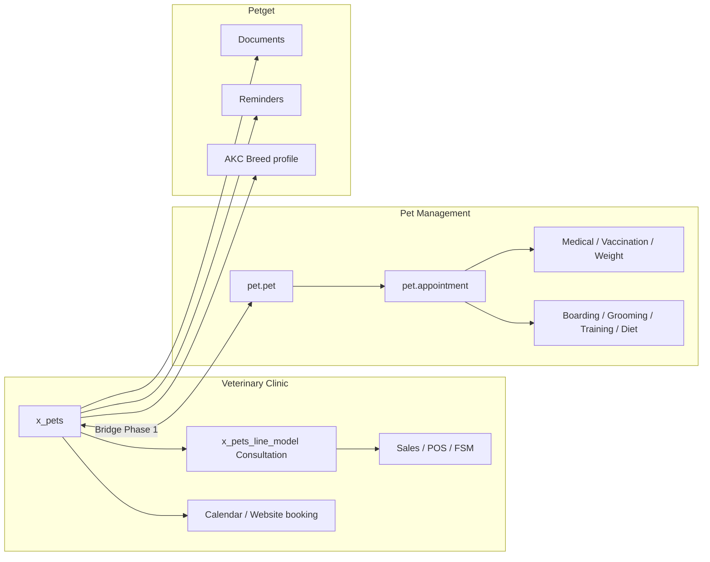
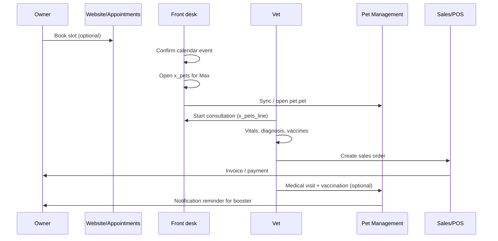

# Veterinary Demo — User Guide & Workflows

**Audience:** Clinic staff, administrators, and demo trainers  
**Stack:** Odoo 19 Enterprise + Veterinary Clinic industry pack + Pet Management + Petget + bridges  
**Last updated:** June 2026

---

## 1. What this demo includes

This environment combines **three layers** that work together:

| Layer | Main app / menu | Purpose |
|-------|-----------------|--------|
| **Clinic (Enterprise)** | **Pets** (heart icon) | Industry veterinary flows: consultations, website booking, CRM, sales, POS, field service |
| **Pet Management** | **Pets** (separate app) | Day-to-day ops: SOAP visits, vaccinations, boarding, grooming, training, diet, internal appointments, invoicing |
| **Petget** | Under **Pets → Configuration** + on dog records | AKC breed knowledge, documents, reminders, pedigree (linked to clinic pets) |

**Bridges** connect the layers so you do not enter the same pet twice:

- **`veterinary_petget_bridge`** — Petget features on clinic `x_pets` records  
- **`veterinary_pet_management_bridge`** — 1:1 link `x_pets` ↔ `pet.pet` with field sync



### When to use which pet screen

| Task | Start here | Why |
|------|------------|-----|
| Consultation chart, labs, illness, vaccines on visit | **Pets → Pets** (`x_pets`) | Studio consultation model + Enterprise billing |
| Website / public appointment | **Appointments** (Calendar) | Wired to `x_pets` and `appointment.type` |
| SOAP note, vaccination schedule, weight history | **Pets app → Pets** (`pet.pet`) | Pet Management health module |
| Boarding, grooming, training, diet | **Pets app** (`pet.pet`) | Not in clinic pack |
| Internal multi-service appointment + invoice | **Pets app → Appointments** | Creates linked medical/grooming/etc. records |
| Dog breed card, pedigree, Petget docs | **Pets → Pets** (`x_pets`, dog) | Petget bridge on clinic record |
| Jump between clinic and PM | Smart buttons **Pet Management** / **Clinic Record** | Bridge module |

> **Phase 1 note:** Consultations and PM medical visits are **not auto-linked** yet. Use both where needed, or open the linked record via smart buttons after sync.

---

## 2. Navigation map

### 2.1 Veterinary Clinic — **Pets** menu

| Menu | What you manage |
|------|-----------------|
| **Pets → Pets** | Pet registry (`x_pets`): owner, species, breed, photo, consultations |
| **Pets → Consultations** | All consultation lines (`x_pets_line_model`) across pets |
| **Pets → Pet Documents** | Petget documents for clinic pets |
| **Pets → Pet Reminders** | Petget reminders (vaccines, meds, custom) |
| **Pets → Configuration → Species / Illnesses / Vaccines / Vaccine Tags** | Clinic master data |
| **Pets → Configuration →** *(Petget)* **Breeds / Life stages / Colours** | Dog knowledge configuration |

**Also:** **Contacts → Pets** — same pet list from the contact-centric view.

### 2.2 Pet Management — **Pets** app

| Menu | What you manage |
|------|-----------------|
| **Core → Pets** | `pet.pet` profiles |
| **Appointments** | Hub appointments (medical, vaccine, grooming, training, boarding flags) |
| **Health → Medical Visits** | SOAP-style visits |
| **Health → Vaccinations** | Vaccination events & boosters |
| **Health → Weight History** | Weight tracking & trends |
| **Boarding → Boarding Stays** | Kennel stays |
| **Grooming → Sessions** | Grooming appointments |
| **Training → Sessions** | Training sessions |
| **Diet → Diet Plans** | Nutrition plans |
| **Operations → Notifications** | Email/SMS notification queue |
| **Configuration → Species, Breeds, Vaccine catalog, Kennels, Grooming services, Training programs** | PM master data |
| **Settings → Pet Management** | Microchip auto-numbering, notifications, durations, integrations |

### 2.3 Other Enterprise apps (clinic demo)

| App | Role in demo |
|-----|----------------|
| **CRM** | Leads for new pet owners; tags and stages |
| **Sales** | Quotes/orders linked to pet consultations |
| **Point of Sale** | Front-desk product sales (food, accessories) |
| **Appointments** | Staff calendar + **website** online booking |
| **Field Service** | Home visits with worksheets |
| **Planning** | Staff scheduling (with FSM bridge) |
| **Documents** | Clinic document workspace |
| **Knowledge** | Internal articles (procedures, species info) |
| **Project** | Tasks linked to clinic operations |

---

## 3. User roles (Pet Management)

Assign under **Settings → Users →** *user* **→ Access Rights**.

| Area | Typical staff group | Admin |
|------|---------------------|-------|
| Core pets | User: All Data or Own Data | Administrator |
| Health | User: All Data | Administrator |
| Appointments | User: All Data | Administrator |
| Boarding / Grooming / Training / Diet | User: All Data | Administrator |
| Configuration | User: All Data | Administrator |
| Operations (notifications) | User: Own Data | — |

**Clinic / Enterprise:** Use standard Odoo groups (Sales User, Project User, FSM User, etc.).

**Tip for demos:** Give administrators **Pet Management** configuration + all area groups so every menu is visible.

---

## 4. Use case scenarios & workflows

Each scenario lists **goal**, **primary path**, **steps**, and **related modules**.

---

### UC-01 — Register a new pet (clinic + Pet Management)

**Goal:** One pet record for clinic and operational modules.

**Primary path:** **Pets → Pets → Create**

1. Open **Pets → Pets → New**.
2. Fill **Name**, **Owner** (contact), **Species**, **Breed**, **Date of birth**, **Gender**, **Microchip** (optional), **Photo**.
3. For **dogs:** set species Dog → choose **AKC breed** (Petget), colour, coat; optional pedigree (sire/dam).
4. **Save**.
5. Click smart button **Pet Management** (or header **Sync to Pet Management** if link missing).
6. On `pet.pet` form, confirm **Clinic Record** smart button opens the same `x_pets`.

**Bridge behaviour:** Creates/updates `pet.pet` with mapped species (Cat, Dog, Hamster, Rabbit). Pets without owner or unmapped species may skip sync.

**Settings:** **Settings → Pet Management** → enable **Auto-generate Microchip Numbers** if you want PM to assign chips on new `pet.pet` records.

---

### UC-02 — Existing clinic pets: bulk sync to Pet Management

**Goal:** Backfill PM after install or data import.

**Primary path:** **Pets → Pets** (list)

1. Open **Pets → Pets**.
2. Select one or more records (or none = run from form header on single pet).
3. **Action → Sync to Pet Management** (or **Sync to Pet Management** on form header).
4. Read notification: *Created X, updated Y pet(s).*

**When to run:** After installing `veterinary_pet_management_bridge`, or when PM record is missing.

---

### UC-03 — Public website appointment (pet owner)

**Goal:** Customer books a vet slot online.

**Primary path:** Website + **Appointments**

1. Pet owner visits clinic **website** → **Appointments** (or embedded booking page).
2. Chooses **appointment type** (e.g. Consultation, Surgery, Dental).
3. Selects slot, enters details (pet name, species, contact).
4. Booking creates **Calendar** event linked to CRM/contact flow.

**Staff follow-up:**

1. Open **Appointments** app → confirm event.
2. Find or create **Pets → Pets** for the animal.
3. Optionally **Sync to Pet Management** for PM health/ops.

**Note:** Website booking uses **Calendar / appointment.type**, not `pet.appointment`. Keep both schedulers until appointment bridge (Phase 5) is implemented.

---

### UC-04 — Front desk: internal appointment (Pet Management hub)

**Goal:** One internal booking that can spawn medical, vaccine, grooming, training, or boarding work.

**Primary path:** **Pets app → Appointments**

1. **Appointments → New**.
2. Select **Pet**, **Title**, **Start / End**, **Primary type** (checkup, emergency, surgery, etc.).
3. Tick service flags: **Medical**, **Vaccination**, **Grooming**, **Training**, **Boarding** as needed.
4. Set **State** → **Confirmed** (with **Auto-create facility** on, linked records are created).
5. Complete work in linked tabs/records (medical visit, vaccination, etc.).
6. **Done** when finished; create **Invoice** from appointment if billing in PM.

**Optional:** Enable **Sync to calendar** in PM settings for `calendar.event` integration.

---

### UC-05 — Veterinary consultation (clinic chart)

**Goal:** Full exam on industry consultation model with vitals, illness, vaccines, attachments.

**Primary path:** **Pets → Pets** → pet form → **Consultations**

1. Open pet in **Pets → Pets**.
2. **Consultations** tab → **Add a line** (or **Pets → Consultations** → New).
3. Enter **Appointment date**, vitals (**Weight**, temperature, heart rate, etc.), **Remarks**, **Illness**, **Vaccines given**, lab/imaging fields as configured.
4. Attach files (Documents integration on lines if enabled).
5. **Save**.

**Billing:**

1. On consultation line, use **Create Sales Order** (server action / button if visible).
2. Or create **Sales → Quotation** manually with pet/consultation link.

**PM parallel (manual today):** Open **Pet Management** from pet → create **Medical Visit** or **Vaccination** for the same event if you need SOAP workflow or booster scheduling.

---

### UC-06 — Medical visit (SOAP) in Pet Management

**Goal:** Structured clinical note outside Studio consultation.

**Primary path:** **Pets app → Health → Medical Visits**

1. **Medical Visits → New** (or from **pet.pet** form → Medical visits).
2. Select **Pet**, **Date**, veterinarian.
3. Fill **Subjective / Objective / Assessment / Plan** (SOAP).
4. Set status through workflow (scheduled → in progress → completed).
5. Link to **Appointment** if created from hub appointment.

**Best for:** Repeat visits, PM notifications, weight/vaccination context on `pet.pet`.

---

### UC-07 — Vaccination program

**Goal:** Track vaccines, due dates, and boosters.

**Primary path:** **Pets app → Health → Vaccinations**

1. Ensure **Configuration → Vaccine catalog** has products/vaccines defined.
2. **Vaccinations → New** — pet, vaccine, date administered, next due date.
3. Or confirm **pet.appointment** with **Vaccination** flag → auto-creates vaccination record.
4. Enable **Auto-schedule Booster Vaccinations** in **Settings → Pet Management** for follow-up records.

**Clinic catalog:** **Pets → Configuration → Vaccines** (`x_vaccines`) is separate; align names with PM catalog for future bridge sync.

---

### UC-08 — Weight monitoring

**Goal:** Trend weight over time (not only per-consult snapshot).

**Primary path:** **Pets app → Health → Weight History**

1. **Weight History → New** — pet, date, weight, notes.
2. Or record weight on **Medical Visit** if configured.
3. View graphs/statistics on pet form (PM widgets).

**Clinic:** Consultation line **Weight** (`x_weight`) is per-visit only unless you copy to PM manually.

---

### UC-09 — Boarding stay

**Goal:** Kennel reservation, check-in/out, billing.

**Primary path:** **Pets app → Boarding → Boarding Stays**

1. **Configuration → Kennels** — define kennels/rooms.
2. **Boarding Stays → New** — pet, kennel, check-in/out datetimes, daily rate.
3. Progress state: draft → confirmed → checked in → checked out.
4. Invoice from stay or via **pet.appointment** with **Boarding** flag.

---

### UC-10 — Grooming session

**Goal:** Book and complete grooming with service catalog.

**Primary path:** **Pets app → Grooming → Sessions**

1. **Configuration → Grooming Services** — services and prices.
2. **Sessions → New** or via **Appointment** (grooming flag + service).
3. Complete session → state **Completed** → invoice if applicable.

---

### UC-11 — Training session

**Goal:** Training programs and session tracking.

**Primary path:** **Pets app → Training → Sessions**

1. **Configuration → Training Programs**.
2. **Sessions → New** — pet, program, trainer, date, objectives.
3. Mark completed; link from hub **Appointment** when **Training** is selected.

---

### UC-12 — Diet plan

**Goal:** Managed feeding plan for pet.

**Primary path:** **Pets app → Diet → Diet Plans**

1. **Diet Plans → New** — pet, start date, duration (default from settings), meals/calories per configuration.
2. Monitor adherence via notes and linked pet form.

---

### UC-13 — Petget: documents & reminders (dogs)

**Goal:** AKC-aligned care docs and scheduled reminders on clinic pet.

**Primary path:** **Pets → Pets** (dog) or **Pets → Pet Documents / Pet Reminders**

**Documents:**

1. Open dog `x_pets` record.
2. Smart button **Documents** → upload/register document (vaccination certificate, pedigree, etc.).
3. Or **Pets → Pet Documents** for cross-pet list.

**Reminders:**

1. Smart button **Reminders** → create reminder (due date, type).
2. Or **Pets → Pet Reminders** for all pets.

**Breed profile:**

1. On dog form, set **AKC breed** → tab **Breed Profile** shows temperament, care ratings, growth (Petget knowledge).
2. **AKC Breed** smart button opens full breed reference.

**Pedigree:** **Pedigree** group — sire/dam links to other clinic pets.

---

### UC-14 — CRM: new pet owner lead to customer

**Goal:** Marketing/sales pipeline for new clients.

**Primary path:** **CRM**

1. **CRM → New** lead — contact, pet interest, source/tags.
2. Qualify → convert to **Opportunity** / **Customer**.
3. Create **Pets → Pets** for their animal(s).
4. **Sync to Pet Management** when ready for clinical/ops modules.

**Demo data:** Seeded leads and tags align with veterinary scenarios.

---

### UC-15 — Sales order from consultation

**Goal:** Bill exam, procedures, and products.

**Primary path:** **Sales** (from consultation or pet)

1. From consultation line: trigger **Create Sales Order** (automated action when configured).
2. Or **Sales → New** — customer = pet owner, link **Pet** / consultation fields as on form.
3. Add product lines (consultation product, medicines from catalog).
4. Confirm → **Invoice**.

**Products:** Seeded catalog via demo scripts (consultation, vaccines, food, etc.).

---

### UC-16 — Point of Sale (retail)

**Goal:** Sell products at reception without a full sales order.

**Primary path:** **Point of Sale**

1. Open **POS** session (demo: configured veterinary POS).
2. Scan/select products (pet food, accessories).
3. Customer optional; payment → receipt.

**Stock:** `pos_stock` bridge keeps inventory aligned with warehouse.

---

### UC-17 — Field service home visit

**Goal:** Vet visit at customer home with worksheet.

**Primary path:** **Field Service**

1. **Field Service → New** task — customer address, pet reference (via sale/project link as seeded).
2. Assign technician; schedule on **Planning** if used.
3. On site: complete **Worksheet** (industry FSM + worksheet bridge).
4. Mark done → invoice time & materials (demo seed includes home visit billing scenarios).

**Access:** Users need FSM / project groups (demo grant scripts apply on Odoo.sh).

---

### UC-18 — Staff planning & calendar

**Goal:** Who works when; align with appointments.

**Primary path:** **Planning** + **Appointments**

1. **Planning** — create shifts for vets/groomers.
2. **Appointments** — calendar view for bookings (website + internal).
3. PM **pet.appointment** may create `calendar.event` when integration enabled in settings.

---

### UC-19 — Documents & Knowledge (clinic operations)

**Goal:** Central files and SOPs.

**Documents:**

1. **Documents** app — workspace folders (demo includes clinic assets).
2. Link uploads to projects, pets, or consultations as per Studio setup.

**Knowledge:**

1. **Knowledge** — browse articles (species care, procedures).
2. Favorites and structure seeded in `veterinary_clinic` demo.

---

### UC-20 — Notifications (Pet Management)

**Goal:** Automated emails/SMS for appointments, vaccines, boarding.

**Primary path:** **Pets app → Operations → Notifications**

1. Configure **Settings → Pet Management** → email/SMS toggles.
2. Crons create **Notifications** (draft → sent / failed).
3. Monitor **Draft**, **Failed**, **Overdue**, **Urgent** submenus.
4. Review **Analytics** for throughput.

**Mail templates:** Defined in `pet_management` data (appointment reminder, vaccination due, etc.).

---

### UC-21 — Configuration & master data setup

**Goal:** Prepare a clean environment before go-live.

**Clinic (`x_*` masters):**

| Item | Menu |
|------|------|
| Species | Pets → Configuration → Species |
| Illnesses | Pets → Configuration → Illnesses |
| Vaccines & tags | Pets → Configuration → Vaccines |

**Pet Management:**

| Item | Menu |
|------|------|
| Species / Breeds | Configuration |
| Vaccine catalog | Configuration |
| Kennels | Configuration |
| Grooming services | Configuration |
| Training programs | Configuration |

**Petget (dogs):**

| Item | Menu |
|------|------|
| AKC breeds | Pets → Configuration → Breeds |
| Life stages / Colours | Configuration |

**Bridge maps:** Species map (Cat, Dog, Hamster, Rabbit) ships in `veterinary_pet_management_bridge` — extend for Horse or exotic species before sync.

**PM settings:** **Settings → Pet Management** (or Settings app block) — microchip prefix, appointment duration, booster automation, calendar/inventory integration flags.

---

### UC-22 — End-to-end day: reception → vet → billing

**Scenario:** Max (dog) has a scheduled checkup.



**Steps (summary):**

1. Appointment on **Calendar** (or walk-in).
2. Open **Pets → Pets** → Max → consultation line.
3. Exam + vaccines + notes.
4. **Create Sales Order** → confirm → invoice.
5. Optional: **Pet Management** smart button → medical visit + vaccination for longitudinal record.
6. Optional: **Petget Reminder** for next vaccine.

---

### UC-23 — End-to-end: grooming + retail

1. **Pets app → Appointments** — grooming flag, service selected, confirmed.
2. Groomer completes **Grooming → Session**.
3. Reception uses **POS** for shampoo/treats sale.
4. Invoice grooming via PM appointment or separate accounting entry.

---

### UC-24 — End-to-end: boarding handover

1. Owner drops pet: **Boarding Stay** checked in (PM).
2. Daily care notes on stay or pet chatter.
3. **Petget Document** for signed boarding agreement on `x_pets` if needed.
4. Check-out → invoice → **Notifications** for pickup confirmation.

---

## 5. Module install order (reference)

For new databases, install in this order:

1. `base_industry_data`, `pos_stock`, `planning_field_service_worksheet`
2. `petget_core` → `petget_dog` → `petget_dog_knowledge`
3. `veterinary_clinic`
4. `veterinary_petget_bridge`
5. `pet_management`
6. `veterinary_pet_management_bridge`
7. Upgrade all → run **Sync to Pet Management**

---

## 6. Troubleshooting

| Symptom | Likely cause | Action |
|---------|--------------|--------|
| Settings crash: `auto_generate_microchip` undefined | Stale server after PM install | Restart Odoo; upgrade `pet_management`; hard-refresh browser |
| **Pet Management** button missing | Bridge not installed | Install `veterinary_pet_management_bridge` |
| Sync skips pet | No owner or unmapped species | Set owner; add species map; use Dog/Cat/Hamster/Rabbit |
| Two different species on PM vs clinic | Map table out of date | Update `pet.clinic.species.map` data |
| Website booking not in PM appointments | By design (Phase A) | Use Calendar for public; PM for internal ops |
| Petget menus duplicated | Old Petget app visible | Ensure `veterinary_petget_bridge` installed (hides standalone app) |
| Consultation not in PM medical visit | Phase 1 bridge | Create medical visit manually or wait Phase 3 |

---

## 7. Related documentation

| Document | Path |
|----------|------|
| Bridge technical plan | `docs/PET_MANAGEMENT_BRIDGE_PLAN.md` |
| Pet Management module | `pet_management-19.0.1.0.0/pet_management/` |
| Veterinary Clinic pack | `veterinary_clinic-saas-19.3.1.3/veterinary_clinic/` |
| Demo seed (remote) | `tools/seed_odoo_sh_veterinary_all.py` |
| Bridge test script | `tools/test_pet_management_bridge.py` |

---

## 8. Quick reference — models by menu

| Menu / feature | Model | Module |
|----------------|-------|--------|
| Clinic pet | `x_pets` | veterinary_clinic |
| Consultation | `x_pets_line_model` | veterinary_clinic |
| PM pet | `pet.pet` | pet_management |
| PM appointment | `pet.appointment` | pet_management |
| Medical visit | `pet.medical.visit` | pet_management |
| Vaccination | `pet.vaccination` | pet_management |
| Boarding | `pet.boarding.stay` | pet_management |
| Grooming session | `pet.grooming.session` | pet_management |
| Training session | `pet.training.session` | pet_management |
| Diet plan | `pet.diet.plan` | pet_management |
| Petget document | `petget.document` | petget_core (via bridge on `x_pets`) |
| Petget reminder | `petget.reminder` | petget_core |
| AKC breed | `petget.dog.breed` | petget_dog |
| Species map | `pet.clinic.species.map` | veterinary_pet_management_bridge |

---

## 9. Automated screenshots (Playwright)

Scenario screenshots can be regenerated from the UI:

```powershell
cd projects/edafa__veterinary_demo/tests/playwright
npm install
npx playwright install chromium
$env:ODOO_PASSWORD = "admin"
npm run test:screenshots
```

Output: `tests/playwright/screenshots/uc*.png` — see [tests/playwright/README.md](../tests/playwright/README.md) for the file ↔ use-case mapping.

---

*For training sessions, walk through UC-22 once on a seeded database, then let users practice UC-04, UC-05, and UC-13 on a test dog.*
