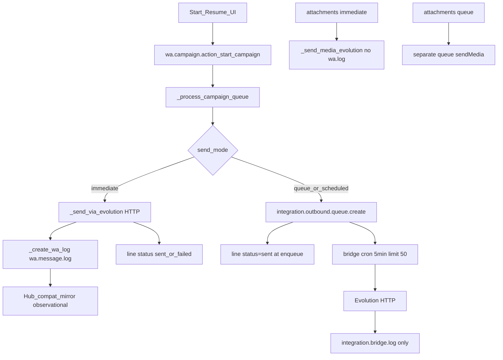

# Phase 5 — WA Campaign Hub Migration Design

**Status:** Approved design — P5A foundation may be implemented with flags OFF / defaults legacy
**Non-goals until later phases:** Production Campaign Hub activation, Discuss changes, media Hub  
**Evidence source:** live code audit of [`wa_campaign.py`](base_odoo_19/projects/pet_spot_elsahel/evolution_whatsapp_chat/models/wa_campaign.py), [`wa_campaign_line.py`](base_odoo_19/projects/pet_spot_elsahel/evolution_whatsapp_chat/models/wa_campaign_line.py), [`discuss_channel.py`](base_odoo_19/projects/pet_spot_elsahel/evolution_whatsapp_chat/models/discuss_channel.py), [`whatsapp_outbound.py`](base_odoo_19/projects/pet_spot_elsahel/whatsapp_hub/models/whatsapp_outbound.py), bridge queue  
**Discuss baseline (must remain unchanged):** #5/#10=`hub`, allowlist=`10,5`, purposes=`discuss`, E3 health healthy  

**Final recommendation:** `READY TO IMPLEMENT PHASE 5A CAMPAIGN FOUNDATION`

---

## 1. Actual Campaign call graph



Important facts:

- Comment “Process in background” is false — Start runs synchronously over **all** pending lines.
- Default `send_mode` is **`queue`**, not immediate.
- Campaign never calls Hub `service_send_message` / `service_queue_outbound`.
- No Campaign-owned cron; queue delivery is bridge’s 5‑minute cron.

---

## 2. All Campaign outbound entry points

| Entry | Sync/sched | Transport | `wa.message.log` | Line sent/failed | Retry owner | Dup risk | Hub mirror |
|-------|------------|-----------|------------------|------------------|-------------|----------|------------|
| `action_start_campaign` → `_process_campaign_queue` | Sync HTTP worker | immediate→HTTP; queue/scheduled→bridge | immediate only | immediate: after HTTP; queue: **at enqueue** | Campaign for lines; bridge retries structurally weak (failed not re-picked) | Concurrent Start possible; no idempotency | immediate yes; queue **no** |
| `action_resume_campaign` | Same | Same | Same | Same | Same | Same | Same |
| `action_retry_failed` / `line.action_retry` | Reset only | None until Start | No | →`pending` | N/A | Later Start can resend | No |
| Attachment follow-up in processor | Same loop | `_send_media_evolution` or bridge media job | **No** | Tied to parent line already written | None dedicated | Yes | **No** |

Direct Evolution sites belonging to Campaign: `_send_via_evolution`, `_send_media_evolution` (plus bridge cron HTTP for queued payloads).

Non-Campaign but related: `whatsapp.send.wizard` / bulk wizard — out of Phase 5 scope.

---

## 3. Current Campaign state machine

**Campaign `state`:** `draft` → (`scheduled` unused by code transitions) → `running` ↔ `paused` → `completed` | `cancelled`

**Line `status`:** `pending` | `sent` | `delivered` | `read` | `failed` | `skipped`  
(No `queued`/`sending` today.)

**Counters:** stored computed on `campaign_line_ids.status` (`total/pending/sent/delivered/read/failed/skipped`, rates).

**Gap:** `line.update_status_from_webhook` is **dead code**; delivered/read on lines are not driven by bridge webhooks. Queue path never sets `wa_message_id`.

---

## 4. Current retry / queue ownership

| Mode | Admit | Transport retry | Status truth |
|------|-------|-----------------|--------------|
| immediate | Campaign loop | None (fail → line failed; manual retry→pending) | Provider HTTP |
| queue/scheduled | Campaign → `integration.outbound.queue` | Bridge `retry_count`/`max_retries` but cron domain `status=pending` only → failed rows not auto-retried | Line marked **sent at enqueue** (false provider truth) |

Hub already has independent `whatsapp.outbound.message` with unique `business_key`, priority ordering, and retry cron — unused by Campaign.

---

## 5. Canonical Campaign identity rule

**Chosen rule (stable, line-atomic):**

```text
business_key = campaign:{campaign_id}:{campaign_line_id}
client_request_id = campaign:{campaign_id}:{campaign_line_id}
source_model = wa.campaign.line
source_res_id = campaign_line_id
purpose = campaign
source_app = campaign
```

Add Hub helper analogous to `discuss_business_key`:

```python
def campaign_business_key(campaign_id, campaign_line_id):
    return f"campaign:{int(campaign_id)}:{int(campaign_line_id)}"
```

**Properties:**

- One logical line → one canonical `whatsapp.message` / one active outbound job (DB unique on `business_key`).
- Replay of same line reuses Hub message/job (no double-send).
- New Campaign (new lines) → new IDs → new identity.
- Body/timestamp never part of key.
- Media attachments are **separate logical messages** and are **out of initial Hub scope** (see §12); text body only uses the key above.

**Compatibility convergence (Hub-first):**

1. Hub creates canonical message + outbound job.
2. After provider accept, create/update `wa.message.log` with `send_origin=hub_unified`, `campaign_id`, `campaign_line_id`, `hub_message_id`, provider id.
3. Mirror must bind to existing Hub message (no new `walog:{id}` twin). Extend compat to prefer `business_key=campaign:…` / `hub_message_id` before creating observational twins.

**Shadow must not reserve this key** for a sendable outbound row (preview-only evidence records).

---

## 6. Campaign ↔ Hub ownership boundary

| Concern | Owner |
|---------|-------|
| Audience, templates, personalization, lines, pause/resume/cancel UX, campaign reporting | **Campaign** |
| Canonical message identity, admission, queue, retries, provider id, message-level status | **Hub** |
| Evolution credentials, one-shot HTTP, normalized response | **Bridge / `whatsapp.hub.transport`** (one-shot only on Hub path) |

Campaign remains UX/orchestrator; Hub becomes transport authority for cutover Campaigns.

---

## 7. Lifecycle mapping

Do **not** invent unsupported Campaign states. Map onto existing line statuses:

| Event | Hub job | Campaign line | Campaign aggregates |
|-------|---------|---------------|---------------------|
| Not yet admitted | — | `pending` | pending++ |
| Hub admitted (queued) | `pending`/`processing` | stay **`pending`** (fix queue anti-pattern) | pending++ |
| Provider accepted | `sent` | `sent` + `wa_message_id` + `sent_date` | sent++ |
| Soft fail / retrying | `pending`/`failed` with retries left | stay `pending` or keep `error_msg` without final fail | pending |
| Exhausted / permanent fail | `failed`/`cancelled` | `failed` + `error_msg` | failed++ |
| Operator cancel pre-accept | `cancelled` | `skipped` or `failed` (choose **`skipped`** for cancel; **`failed`** for transport fail) | |
| Delivered/read | webhook→Hub/log | later enrichment via wired webhook (P5E+) | delivered/read |

**Hard rule:** never mark line `sent` on Hub admission alone.

Projection: Campaign observes Hub via soft ints `campaign_id`/`campaign_line_id` already on Hub models + optional `hub_message_id` / `hub_outbound_id` fields on line (additive, Campaign-owned FKs soft).

---

## 8. Queue / throttling strategy

**Final Hub Campaign path (single retry owner):**

```text
Campaign orchestrator admits ≤N pending text lines
  → Hub service_queue_outbound / service_send_message
  → whatsapp.outbound.message
  → Hub retry cron
  → bridge one-shot Evolution
```

**`integration.outbound.queue`:** used only by **legacy** Campaign modes until cutover. Hub-mode Campaigns must **not** create bridge queue transport jobs (no dual retry).

**Admission controls (new):**

- `admit_batch_size` default **25** lines per Start/Resume tick (replace unbounded loop).
- Optional Campaign cron later for long runs (P5E); P5A–P5D keep Start-driven batches.
- Hub `max_pending_campaign_jobs` ICP (default **100** per instance) → backpressure: stop admitting when exceeded.
- Keep `delay_between` only for legacy immediate; Hub path relies on Hub worker pacing + Evolution options delay.

---

## 9. Priority / fairness strategy

Hub `_order = "priority desc, id asc"`; field exists (`default=5`).

| Traffic | Default priority |
|---------|------------------|
| Discuss / 1:1 | **10** |
| Clinic/critical (future) | **15** |
| Campaign | **3** |
| CRM automation (future) | **5** |

Discuss jobs already in Prod used default 5; when Campaign Hub activates, **raise Discuss admits to 10** in Discuss code path only in a later compatibility tweak **or** set Campaign to **3** so current Discuss (5) still wins. **Chosen:** Campaign Hub admits with `priority=3`; leave Discuss at current default (5) initially — Discuss wins without touching Discuss cutover flags. Optional later Discuss bump is non-blocking.

---

## 10. Feature-flag and allowlist design

**Do not reuse Discuss cutover flags.** Additive hierarchy:

1. `whatsapp_hub.unified_outbound_enabled` (existing global)
2. **`whatsapp_hub.campaign_cutover_enabled`** (new global, default OFF)
3. Instance `unified_outbound_enabled` (existing)
4. **`whatsapp.instance.campaign_cutover_enabled`** (new, default OFF)
5. **`whatsapp_hub.campaign_hub_allowed_campaign_ids`** (CSV, empty = **fail-closed**)
6. Purpose gate: `whatsapp_hub.unified_outbound_purposes` must include `campaign` when enabling (today Prod = `discuss` only — **additive** `discuss,campaign`; never remove `discuss`)
7. Per-campaign routing mode on `wa.campaign`: `wa_outbound_mode` ∈ `legacy|shadow|hub` (default **`legacy`**)

Hub send requires: flags ON + purpose allowed + campaign id in allowlist + mode=`hub` + text-only eligibility.

Shadow: mode=`shadow` ignores allowlist for comparison (like Discuss), never Hub-sends.

---

## 11. Campaign shadow-mode design

**New model:** `whatsapp.campaign.shadow` (do **not** overload Discuss `whatsapp.discuss.shadow`).

Flow:

1. Build Hub **candidate** (destination, instance, purpose, business_key, body, campaign/line ids) — validate only.
2. Legacy send once (current path).
3. If immediate → log mirrors; if queue → capture bridge queue payload as actual (note: weaker evidence).
4. Compare destination, instance, campaign/line, identity, rendered text.
5. Store matched/mismatch; **never** create Hub outbound job; **never** reserve sendable `business_key` on `whatsapp.message`.

Prefer shadow UAT on **`send_mode=immediate`** first (real `wa.message.log` + mirror). Queue-mode shadow is secondary because Hub currently never sees those sends.

---

## 12. Text / media / template readiness

| Capability | Today | Phase 5 |
|------------|-------|---------|
| Plain text + `evo.wa.template` (local placeholders) | Yes | **Safe for pilot** |
| Attachments / media | Yes (`sendMedia`) | **Blocked** until Hub media (`SUPPORTED_MESSAGE_TYPES` is text-only) |
| Meta Cloud templates / buttons | Not used | N/A |
| Queue default mode | Yes | Pilot uses **immediate-equivalent Hub path** (Hub queue, not bridge queue) |

**Eligibility rule:** Hub/shadow Campaign must have **empty `attachment_ids`**; otherwise force legacy and surface ops warning.

---

## 13. Compatibility-log convergence

Hub Campaign send:

- `send_origin=hub_unified`
- `campaign_id` / `campaign_line_id` set
- `hub_message_id` set
- provider id on log + line
- mirror converges to same Hub message
- no `walog:*` twin; no mirror-triggered send

Legacy Campaign remains `send_origin=legacy` + observational mirror when logs exist.

---

## 14. Failure / retry design

- Hub owns retries; bridge one-shot.
- Temporary fail → Hub reschedule; line stays non-`sent`.
- Exhaustion → Hub `failed` → line `failed`.
- Unknown acceptance → quarantine semantics (mark uncertain; **never** legacy-resend same `business_key`).
- Operator retry: reset line to `pending` only if no Hub job in `sent`/`processing` with provider id; otherwise reuse same Hub message via requeue API — **no second canonical identity**.

---

## 15. Pause / resume / cancel

| Action | New admissions | Admitted Hub jobs | Provider-accepted |
|--------|----------------|-------------------|-------------------|
| Pause | Stop | Leave running (or freeze admit only) | Untouched |
| Resume | Continue pending lines not yet Hub-sent | No duplicate admit (idempotent key) | Untouched |
| Cancel | Stop | **`service_quarantine_campaign(campaign_id)`** cancels incomplete Hub jobs | Never cancel/resend |

Design new Hub API (implement later): `whatsapp.outbound.message.service_quarantine_campaign(campaign_id, reason=...)` mirroring Discuss quarantine, filtered by `purpose=campaign` + `campaign_id`.

Cancel must **not** touch Discuss jobs or channels #5/#10.

---

## 16. Health monitoring

Keep E3 `whatsapp.discuss.hub.health` **Discuss-only**.

Add later: `whatsapp.campaign.hub.health` (or scoped service) checking:

- Hub-mode Campaign not allowlisted
- Campaign unified job outside allowlist
- Stale pending Campaign jobs
- Dup provider / business keys for `purpose=campaign`
- Legacy leakage on Hub-mode Campaign
- Line↔Hub divergence (line `sent` without Hub `sent`, etc.)
- High pending volume / Discuss starvation signals

Not part of P5A minimum; design in P5E.

---

## 17. Rollback hierarchy (isolates Discuss)

1. **Campaign:** mode→`shadow`/`legacy`; quarantine that campaign’s Hub jobs; remove from allowlist.
2. **Instance Campaign:** quarantine instance campaign jobs; instance `campaign_cutover_enabled=OFF`.
3. **Global Campaign:** quarantine all `purpose=campaign` incomplete jobs; allowlist empty; `campaign_cutover_enabled=OFF`; remove `campaign` from purposes CSV **without** removing `discuss`.

**Never** change Discuss allowlist, #5/#10 modes, Discuss cutover flags, or E3 cron.

---

## 18. Controlled Production pilot design (not executed now)

- Dedicated test Campaign, **≤3** text-only recipients, `attachment_ids` empty.
- `wa_outbound_mode=hub`, id in allowlist, Campaign flags ON, purposes=`discuss,campaign`.
- All other Campaigns remain `legacy`.
- Success: 3 lines → 3 Hub messages → 3 jobs → 3 provider IDs → 3 hub_unified logs → 0 legacy sends for those lines → 0 duplicates → counters match Hub truth → Discuss health still healthy / #5/#10 unchanged.

---

## 19. Phased implementation plan

### P5A — Foundation (next implementation task)

- Objective: identity helper, flags/allowlist ICPs + instance fields, Campaign `wa_outbound_mode`, shadow model + evidence writer, adapter interface stub (no Production send), eligibility (text-only), docs/tests.
- Code: `whatsapp_hub` + thin hooks in `evolution_whatsapp_chat` (default still legacy).
- Flags: all OFF; allowlist empty.
- Exit: tests green; Prod upgrade optional/no-op routing; Discuss unchanged.

### P5B — Hub adapter in `_process_campaign_queue`

- Branch: if hub-eligible → Hub queue admit; else legacy.
- Line stays pending until Hub sent (projection hook/cron or write-back on Hub state change).
- No dual bridge queue on Hub path.
- Tests + Test UAT; Prod flags still OFF.

### P5C — Controlled shadow Campaign (Test then Prod test campaign)

- mode=`shadow`; compare candidate vs legacy immediate path.
- Exit: ≥10 matched, 0 unexplained mismatches (or documented).

### P5D — 3-recipient Production Hub pilot

- Explicit allowlist + flags; text-only.
- Exit: pilot success criteria in §18; Discuss untouched.

### P5E — Low-volume soak + health + batching cron

### P5F — Broader text Campaign cutover (eligible empty-attachment campaigns)

### P5G — Media/template Hub enablement (blocked until Hub transport supports)

### P5H — Deprecate Campaign→`integration.outbound.queue` transport for Hub-eligible traffic

Each phase: objective, flags, tests, UAT, rollback, exit criteria (expanded in implementation docs under `docs/whatsapp_hub_consolidation/migration/phase5_campaign/`).

---

## 20. Blockers vs non-blockers

**Blockers to initial text Hub pilot (P5D):**

- Dual-queue risk if Hub path still enqueues bridge jobs
- Line `sent`-at-enqueue semantics must be fixed on Hub path
- Fail-closed Campaign flags/allowlist not yet built
- Idempotency `campaign:{id}:{line_id}` not wired
- Compat must not create `walog:*` twins for Hub-first sends
- Media campaigns must be excluded

**Blockers to full Campaign migration:**

- Hub media/`sendMedia` support
- Queue-mode parity / scheduled_date semantics on Hub
- Delivery/read projection wiring (dead webhook updater)
- High-volume fairness + Campaign health service
- Historical campaigns already “sent” via bridge without logs

**Can wait:** Discuss priority bump, Campaign UI polish, Meta templates, weekly script Hub awareness.

---

## 21. Exact recommended first implementation task

**Implement P5A only** after design approval:

1. Write design doc to `docs/whatsapp_hub_consolidation/migration/phase5_campaign/PHASE5_CAMPAIGN_HUB_MIGRATION_DESIGN.md` (content = this plan).
2. Add `campaign_business_key`, Campaign cutover ICPs/fields, `wa.campaign.wa_outbound_mode`, `whatsapp.campaign.shadow`, eligibility helper, quarantine API stub for campaign, tests proving defaults remain legacy and Discuss routing untouched.
3. **Do not** enable flags, allowlist any campaign, or change Production Campaign sends.

---

## 22. Confirmation — Discuss remains unchanged

Phase 5 design and P5A implementation must not modify:

- Discuss routing / allowlist `10,5` / #5/#10 modes  
- Discuss cutover flags / E3 health cron semantics  
- `unified_outbound_purposes` removal of `discuss`  

Campaign cutover is a **parallel** control plane.

---

## Final recommendation

`READY TO IMPLEMENT PHASE 5A CAMPAIGN FOUNDATION`
