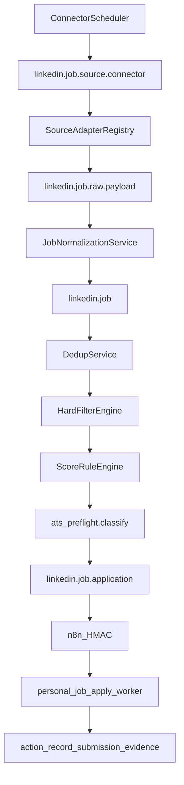

# Job Source Expansion Plan (Approved for Autonomous Execution)

**Module:** `linkedin_connector`  
**Target versions:** `19.0.2.19.0` → `19.0.2.20.0`  
**Evidence stamp:** `20260804T035419Z`  
**Safety:** TEST-first; `live_submit_enabled=False`; no LinkedIn/Indeed scrape; evidence-gated `applied`.

**Refinements applied:** tri-state unknown policy; techno-functional allowed; raw/normalized score 0–100; raw payload retention; deterministic dedupe first; MVP source priority.

---

# Job Source Expansion Plan

**Proposed durable doc path (do not create until approved):**  
[`/home/sabry/odoo_base/base_odoo_19/projects/pet_spot_elsahel/linkedin_connector/docs/JOB_SOURCE_EXPANSION_PLAN.md`](/home/sabry/odoo_base/base_odoo_19/projects/pet_spot_elsahel/linkedin_connector/docs/JOB_SOURCE_EXPANSION_PLAN.md)

**Module / versioning:** stay in [`linkedin_connector`](/home/sabry/odoo_base/base_odoo_19/projects/pet_spot_elsahel/linkedin_connector) — bump `19.0.2.18.2` → `19.0.2.19.0` (framework) then `19.0.2.19.N` / `19.0.2.20.0` per phase. No new addon.

**Isolation default:** all work on TEST `pet_spot_elsahel_test` (:8028). Keep `live_job_search_enabled=False`, `live_submit_enabled=False`, discovery crons inactive until Phase 10 approval.

---

## 1. Current-state findings

Personal job hunt is a feature pack inside **`linkedin_connector`**, not a separate `personal_job_*` module, plus:

| Layer | Path / model |
|-------|----------------|
| Discovery + scoring | [`models/linkedin_job.py`](/home/sabry/odoo_base/base_odoo_19/projects/pet_spot_elsahel/linkedin_connector/models/linkedin_job.py) (`linkedin.job`) |
| ATS registry | [`linkedin.ats.source`](/home/sabry/odoo_base/base_odoo_19/projects/pet_spot_elsahel/linkedin_connector/models/linkedin_ats_source.py) + [`services/ats_feeds.py`](/home/sabry/odoo_base/base_odoo_19/projects/pet_spot_elsahel/linkedin_connector/services/ats_feeds.py) |
| Channel ingest | `linkedin.job.channel.source` (Telegram/FB scaffold) |
| Preflight | [`services/ats_preflight.py`](/home/sabry/odoo_base/base_odoo_19/projects/pet_spot_elsahel/linkedin_connector/services/ats_preflight.py) |
| Applications | `linkedin.job.application` + `linkedin.apply.attempt` + `linkedin.apply.policy` |
| Profile/CV | `linkedin.candidate.profile`, `linkedin.cv.version`, `linkedin.answer.library` |
| Worker | [`personal_job_apply_worker`](/home/sabry/odoo_base/base_odoo_19/projects/pet_spot_elsahel/personal_job_apply_worker) :8095 |
| Orchestrator | HMAC API [`controllers/job_orchestrator_api.py`](/home/sabry/odoo_base/base_odoo_19/projects/pet_spot_elsahel/linkedin_connector/controllers/job_orchestrator_api.py) + n8n UAT/prod + Dify pack |

**Sources today:** JSearch (RapidAPI), Arbeitnow, Remotive, RemoteOK (wizard), Greenhouse/Lever/Ashby/Workable/company_ats, LinkedIn guest (disallowed for prod cron), Telegram/FB scaffolds, manual.

**Crons (XML, `active=False`):** daily JSearch, aggregators, digest; Telegram 6h; Facebook daily. ATS discovery method exists but is **n8n/API-driven**, not XML-cronned.

**Scoring:** hardcoded in `_score_job_values` (Odoo +30, senior +25, stack +10, geo +10, CV boost, junior/unrelated −40). Threshold informational only.

**Dedupe:** single SHA-256 fingerprint `company|title|job_id_or_url`; highest score = canonical; `is_duplicate` / `duplicate_of_id` kept.

**Applied rule (non-negotiable, keep):** only via `action_record_submission_evidence` with proof — never from discovery alone.

---

## 2. Gap analysis

| Requirement | Status |
|-------------|--------|
| Reusable connector registry (credentials, caps, checkpoints, trust) | Partial — ATS + channel models only; aggregators hardcoded in `linkedin.job` |
| Jooble / Adzuna / SmartRecruiters / Recruitee | Missing |
| Unified remote/visa/salary/country schema | Missing — only `remote` bool + free-text `location` |
| Multi-level dedupe + description fingerprint | Partial — one fingerprint |
| Configurable scoring rules as Odoo records | Missing — Python hardcoded |
| Hard-filter reasons as structured records | Partial — `discovery_class` / `discovery_blocker` / preflight JSON |
| Raw payload archive | Missing |
| Job discovery lifecycle states (discovered→qualified→…) | Missing on job; application FSM is separate and richer |
| Connector health UI / source performance | Partial — Caught Jobs Dashboard by `source_channel` |
| Regional boards (Wuzzuf, Bayt, …) | Missing — need compliance feasibility |
| LinkedIn/Indeed compliant discovery | Policy exists; no email-alert ingest model yet |
| Staggered connector scheduler + backoff | Partial — kill switches + JSearch quotas only |

---

## 3. Recommended source priority

1. **Phase 3:** Jooble + Adzuna (paid/official search APIs; best Gulf/global coverage complement to JSearch)  
2. **Phase 4:** Harden Arbeitnow / Remotive / RemoteOK as first-class connectors (already code-present)  
3. **Phase 5–6:** Expand Greenhouse / Lever / Ashby / Workable registry + add SmartRecruiters + Recruitee public career APIs  
4. **Keep JSearch** as quota-capped RapidAPI channel (do not remove)  
5. **Phase 7:** Regional — feasibility first; most → `MANUAL_DISCOVERY_ONLY` or `CONDITIONAL_PUBLIC_PAGE` until ToS/API proof  
6. **LinkedIn / Indeed:** never scrape/automate apply; email alerts + manual URL paste + employer URLs found elsewhere  

---

## 4. Source compliance matrix

| # | Source | Method | Auth | Scraping | Rate notes | Risk | Status | Phase | Fallback |
|---|--------|--------|------|----------|------------|------|--------|-------|----------|
| 1 | Jooble | Official API | API key | No | Per-plan | Low if ToS OK | `APPROVED_API` | 3 | Manual URL |
| 2 | Adzuna | Official API | app_id/key | No | Per-country quotas | Low | `APPROVED_API` | 3 | Jooble/JSearch |
| 3 | Arbeitnow | Public API | None | No | Be polite | Low | `APPROVED_PUBLIC_FEED` | 4 | Remotive |
| 4 | Remotive | Public API | None | No | Be polite | Low | `APPROVED_PUBLIC_FEED` | 4 | Arbeitnow |
| 5 | Remote OK | Public JSON feed | None | No | Cache; respect robots | Low–med | `APPROVED_PUBLIC_FEED` | 4 | Remotive |
| 6 | Greenhouse | Job Board API | Board token (public) | No | Per board | Low | `APPROVED_PUBLIC_ATS` | 5 | Manual career URL |
| 7 | Lever | Postings API | Site slug (public) | No | Per site | Low | `APPROVED_PUBLIC_ATS` | 5 | Manual |
| 8 | Ashby | Job board API | Board name | No | Per board | Low | `APPROVED_PUBLIC_ATS` | 5 | Manual |
| 9 | Workable | Widget/XML public | Account/feed URL | No HTML scrape of gated pages | Per account | Low–med | `APPROVED_PUBLIC_ATS` | 6 | XML only if published |
| 10 | SmartRecruiters | Public postings API | Company identifier | No | Per company | Low | `APPROVED_PUBLIC_ATS` | 6 | Manual |
| 11 | Recruitee | Public offers API | Company subdomain | No | Per company | Low | `APPROVED_PUBLIC_ATS` | 6 | Manual |
| 12–17 | Wuzzuf, Bayt, GulfTalent, Naukrigulf, Tanqeeb, Forasna | TBD per vendor | Usually partner/login | **Do not scrape** | N/A | High if scraped | Start `MANUAL_DISCOVERY_ONLY`; promote only with written API/partner proof | 7 | Email alerts + pasted URLs |
| 18 | LinkedIn | Alerts / manual / partner API only | User account for manual | **Rejected automation** | N/A | High | `REJECTED_AUTOMATION` / `MANUAL_DISCOVERY_ONLY` | ongoing | Guest inventory already discouraged in prod |
| 19 | Indeed | Alerts / publisher API if licensed | Partner | **Rejected automation** | N/A | High | `REJECTED_AUTOMATION` / `MANUAL_DISCOVERY_ONLY` | ongoing | Employer apply URL from other sources |

---

## 5. Target architecture



**Reuse:** keep `linkedin.job` as the unified job store; keep application FSM + worker + HMAC orchestrator unchanged for apply. Discovery expansion stops at `application_ready` / existing shortlist→pack→approve path.

**Concrete model choice:** add **`linkedin.job.source.connector`** (user’s connector concept, namespaced). Keep **`linkedin.ats.source`** as employer-board registry rows that **link** to a connector (`ats_type` boards become connector subtype `public_ats` with `board_token`). Do not delete ATS model in Phase 1 — migrate gradually so existing seeds/`run_discovery_cycle` keep working.

---

## 6. Proposed Odoo models and fields

### New: `linkedin.job.source.connector`

Fields: `name`, `code` (unique), `source_type` (`official_api|public_feed|public_ats|manual|email_alert|restricted`), `adapter_key`, `base_url`, `api_key_param` (ICP key name, not raw secret), `enabled`, `environment` (`test|prod`), `fetch_interval_minutes`, `max_jobs_per_run`, `monthly_request_limit`, `daily_request_limit`, `requests_used_month`, `requests_used_day`, `supported_countries` (Char/JSON), `keyword_set_id`, `last_success_at`, `last_error`, `rate_limit_until`, `cursor_json`, `trust_level` (0–100), `compliance_class`, `compliance_notes`, `raw_archive_enabled`, `consecutive_failures`, `auto_disable_after_failures` (default 5).

### New: `linkedin.job.raw.payload`

`connector_id`, `fetched_at`, `http_status`, `request_meta_json` (no secrets), `payload_attachment_id` or sanitized `payload_text`, `job_ids` M2M after normalize.

### New: `linkedin.job.score.rule` + `linkedin.job.filter.rule`

Configurable points/hard filters: `code`, `sequence`, `active`, `rule_type` (`bonus|penalty|hard_reject`), `match_scope` (`title|blob|location|remote_policy|…`), `pattern` / domain XML, `points`, `reason_code`, `reason_label`, `stop_further_matching` (anti double-count group via `mutex_group`).

### New: `linkedin.job.rejection` (or One2many on job)

`job_id`, `reason_code`, `reason_label`, `rule_id`, `created_at`, `pipeline_stage` (`hard_filter|dedupe|preflight`).

### New: `linkedin.job.source.link`

Secondary sightings: `job_id` (master), `connector_id`, `external_id`, `source_url`, `fetched_at` — preserves multi-board syndication without silent delete.

### Extend `linkedin.job` (additive fields)

| Field | Notes |
|-------|-------|
| `lifecycle_state` | discovered / normalized / duplicate / rejected / qualified / high_priority / application_ready / expired / archived (+ map blocked_* at application/attempt layer) |
| `employer_domain`, `country_code`, `city`, `location_text` | normalize geo |
| `remote_policy` | `onsite|hybrid|remote_world|remote_emea|remote_eu|remote_us|remote_country|relocation|unknown` |
| `visa_sponsorship`, `relocation_support`, `work_auth_required` | Selection enums |
| `salary_min/max`, `salary_currency`, `salary_period` | |
| `experience_min/max` | |
| `skills_required`, `skills_preferred` | Text/JSON |
| `language`, `published_at`, `expiry_at`, `fetched_at` | |
| `description_fingerprint` | SHA of normalized plain description |
| `source_trust_score`, `match_score` (alias keep `score`) | |
| `original_application_url`, `source_url` | split listing vs apply |
| `connector_id`, `external_job_id` | complement `job_id` / `external_ats_id` |
| `rejection_ids`, `source_link_ids`, `score_lines_json` | transparency |

**Existing kept:** `title`, `company`, `location`, `remote`, `description`, `apply_url`, `apply_platform`, `source_channel`, `fingerprint`, `is_duplicate`, `duplicate_of_id`, `score`, `score_breakdown`, `discovery_class`, `preflight_json`, ATS links.

### Extend selections

`source_channel` += `jooble`, `adzuna`, `smartrecruiters`, `recruitee`, `email_alert`, `wuzzuf`, `bayt`, … (even if connector disabled).

### ICP keys (secrets via params / private files, never Git)

`linkedin_connector.jooble_api_key`, `adzuna_app_id`, `adzuna_app_key`, plus existing RapidAPI/orchestrator keys; separate TEST/PROD values; connector.`environment` selects which ICP prefix to read (`…_test` / plain).

---

## 7. Adapter design

**Registry:** `services/job_sources/registry.py` → `get_adapter(connector) -> BaseJobSourceAdapter`

**Base:** `services/job_sources/base.py` — `BaseJobSourceAdapter`

Methods: `fetch_jobs(checkpoint) -> FetchResult`, `normalize_job(raw) -> NormalizedJobDict`, `build_source_uid(raw)`, `extract_application_url(raw)`, `parse_location(raw)`, `parse_salary(raw)`, `parse_remote_policy(raw)`, `parse_sponsorship(raw)`.

**Concrete adapters (class names only):**

| Class | Maps from |
|-------|-----------|
| `JoobleAdapter` | Jooble search API |
| `AdzunaAdapter` | Adzuna jobs endpoint |
| `ArbeitnowAdapter` / `RemotiveAdapter` / `RemoteOkAdapter` | refactor existing fetchers out of `linkedin_job.py` |
| `JsearchAdapter` | wrap existing RapidAPI client |
| `GreenhouseAdapter` / `LeverAdapter` / `AshbyAdapter` / `WorkableAdapter` | move from `ats_feeds.py` |
| `SmartRecruitersAdapter` / `RecruiteeAdapter` | new public ATS |
| `ManualUrlAdapter` / `EmailAlertAdapter` | user-provided / parsed alert payloads |
| `RestrictedSourceAdapter` | LinkedIn/Indeed — **raises** `ComplianceError` on fetch; only accepts manual normalize |

**Data flow:** connector cron → adapter.fetch → raw archive → normalize → `linkedin.job` create/update → pipeline services.

---

## 8. Import and normalization flow

```text
fetch → raw payload archive → normalize → validate
→ deduplicate → hard filters → scoring → classification (preflight)
→ lifecycle_state + optional application create (if auto_create + qualified)
```

Validation fails (no title / no apply URL / expired) → `rejected` with reason codes.  
Raw archive strips Authorization headers and API keys before store.

---

## 9. Filtering and scoring rules

**Hard filters** (`linkedin.job.filter.rule`, machine `reason_code` + human label): junior/intern/trainee; unsupported remote; EU auth required w/o sponsorship; expired; no valid application URL; non-Odoo ERP primary; pure functional no tech; duplicate; company/agency blacklist; suspicious/incomplete.

**Scoring** (seed `linkedin.job.score.rule`, replace hardcoded weights gradually; call from `_score_job_values` via rule engine):

```text
+35 Odoo in title | +20 Senior/Lead/Architect | +15 Python+PostgreSQL
+10 Enterprise/Odoo.sh | +10 UAE/SA | +10 visa/relocation | +10 remote world/EMEA
+8 Accounting/CRM/POS/Inventory/HR/Website | +8 API/integration | +5 Docker/Linux/DevOps
−40 junior/intern | −35 auth required no sponsorship | −30 unsupported remote country
−25 pure functional | −20 non-Odoo ERP primary | −15 missing employer/details
```

**Anti double-count:** `mutex_group` (e.g. one geo bonus); title Odoo vs blob Odoo same group.  
**UI:** `score_breakdown` + `score_lines_json` list rule codes/points.  
**Score never alone blocks apply** — hard filter or preflight `ineligible` does.

**Target roles / location priority:** encode as filter+score rules matching Sabry profile (`linkedin.candidate.profile` already has visa/relocation/work mode — use as input to sponsorship/remote parsers).

---

## 10. Deduplication design

Levels (in order):

1. `(connector_id, external_job_id)` unique  
2. Canonical `original_application_url` / `apply_url` (normalized netloc+path)  
3. `norm(company)+norm(title)+country/city`  
4. `description_fingerprint`  
5. Optional similarity (≥0.92 token Jaccard) across aggregators → link not merge-delete  

**Master selection:** prefer highest `trust_level` connector, then richest description, then highest score, then oldest `fetched_at`. Losers: `lifecycle_state=duplicate`, `is_duplicate=True`, `duplicate_of_id=master`, plus `linkedin.job.source.link` rows. Never silent delete.

---

## 11. Cron and API-limit strategy

**New crons (Cairo time, inactive by default):**

| XML id | Schedule (Africa/Cairo) | Method |
|--------|-------------------------|--------|
| `ir_cron_job_source_scheduler` | every 15 min | `linkedin.job.source.connector._cron_scheduler` (picks due connectors, **one at a time**, advisory lock) |
| Keep | JSearch ~08:00 | existing `_cron_daily_jsearch` |
| Keep | Aggregators → migrate into connectors | `_cron_daily_aggregators` becomes thin wrapper then retire |
| New | `ir_cron_direct_ats_discovery` 09:30 | wire existing `_cron_direct_ats_discovery` into XML |
| Keep | Digest ~18:00 | |

**Per-connector:** jitter ±3–7 min; exponential backoff on 429/5xx; preserve `cursor_json`; disable after N auth/schema failures; global ICP caps `job_discovery_max_requests_per_day/month`.

**Recommended daily (Cairo):** 07:45 Jooble → 08:00 JSearch → 08:30 Adzuna → 09:00 free aggregators → 09:30 ATS boards (chunked) → 12:00 low-volume ATS remainder → 18:00 digest. Never overlap via scheduler lock.

---

## 12. Security controls

- Secrets only in ICP / `/home/sabry/private/job_orchestrator` — never Git/logs  
- Groups: reuse `group_linkedin_job_hunt`; add `group_linkedin_job_source_manager` for connector credentials  
- Personal account id=2 only for writes  
- Keep HMAC orchestrator signing  
- SSRF: allowlist schemes/hosts for fetch/apply URL validation; block link-local/metadata IPs  
- Sanitize HTML descriptions (existing Html field + bleach/odoo html_sanitize)  
- Attachment whitelist for raw payloads (JSON/txt only)  
- Audit: `mail.thread` on connector + rejection reasons; log connector code not keys  

---

## 13. UI changes

Menus under Jobs:

- Job Sources (connectors) · Imported Jobs · Qualified · High Priority · Rejected · Duplicates · Blocked Applications (reuse Human Required) · Connector Health · Daily Import Report · Source Performance · Application Conversion  

Job form notebooks: Match explanation · Rejection reasons · Score breakdown · Source history/links · Apply URL · Sponsorship interpretation · Remote eligibility.

Extend Caught Jobs Dashboard aggregations by `connector_id` / new channels.

---

## 14. Test plan

Extend [`tests/`](/home/sabry/odoo_base/base_odoo_19/projects/pet_spot_elsahel/linkedin_connector/tests): per-adapter unit tests with HTTP fixtures; pagination; 429 backoff; bad JSON; dedupe levels; score rules; remote/visa parsers; multi-account isolation; cron idempotency; upgrade scripts; **no live HTTP / no live submit** (`requests` mocked). Worker tests remain fixture-only.

---

## 15. Deployment and rollback

1. Upgrade TEST module version → run tests → enable connectors in `environment=test` only  
2. Evidence pack under `docs/uat_evidence/job_source_expansion_<stamp>/`  
3. Prod: module upgrade with connectors **disabled**; enable one connector at a time  

**Rollback:** disable connectors + crons; revert to previous module version; raw payloads retained for audit; no mass job delete.

---

## 16. Phased backlog

| Phase | Scope | Key touchpoints | DB | Gate |
|-------|-------|-----------------|----|------|
| 0 | Inspect/freeze baseline inventory | docs only | none | inventory CSV |
| 1 | `linkedin.job.source.connector` + scheduler + base adapter | models/, services/job_sources/, cron XML | new tables | unit tests green |
| 2 | Unified fields + raw payload + normalize pipeline | `linkedin_job.py`, migrations `19.0.2.19.0` | additive columns | backfill fingerprint |
| 3 | Jooble + Adzuna | adapters + ICP | connector rows | mock + 1 TEST live fetch optional |
| 4 | Arbeitnow/Remotive/RemoteOK as connectors | refactor job.py fetchers | migrate channel codes | parity with old cron |
| 5 | GH/Lever/Ashby via connector link | ats_feeds → adapters | link ats.source | discovery cycle parity |
| 6 | Workable + SmartRecruiters + Recruitee | new adapters + seeds | ATS seeds | public boards only |
| 7 | Regional feasibility memo | docs + manual/email adapters | blacklist seeds | Sabry approval per source |
| 8 | Score/filter/dedupe tuning | rule data XML | rule rows | precision sample ≥30 jobs |
| 9 | TEST UAT | UAT doc | none | checklist sign-off |
| 10 | Prod enablement | ICP + cron active flags | none | one connector/day |

Each phase: tests, risks (quota/ToS), rollback (disable connector), acceptance, evidence, approval gate.

---

## 17. Risks and blockers

- Jooble/Adzuna account ToS and cost vs JSearch overlap  
- Regional boards: no safe API → stay manual  
- Schema drift on free feeds  
- Over-fetch burning monthly caps  
- False hard-rejects on hybrid titles (“functional” + Odoo technical)  
- `linkedin_job.py` size (~2.3k LOC) — refactor risk; do adapters first, thin wrappers  
- Compensation floor USD 1,000/mo may be too low for UAE/EU senior roles — confirm intent  

---

## 18. Decisions requiring Sabry’s approval

1. Proceed inside `linkedin_connector` (recommended) vs extract `personal_job_hunt` addon later  
2. Buy/register Jooble + Adzuna API credentials (TEST then PROD)  
3. Confirm compensation floor (USD 1,000 vs likely higher Gulf/EU targets)  
4. Which Greenhouse/Lever/… employer boards to seed beyond current `ats_source_data.xml`  
5. Regional Phase 7: accept **manual-only** until vendor API proof  
6. When to activate `ir_cron_job_source_scheduler` on TEST / PROD  
7. Whether email-alert IMAP ingest is in scope for Phase 7 or deferred  
8. Approval to write the durable markdown at the path above after plan acceptance  

---

## 19. Final recommended execution order

Phase 0 inventory → 1 connector framework → 2 schema/pipeline → 3 Jooble/Adzuna → 4 free aggregators refactor → 5–6 ATS expansion → 8 filters/scoring/dedupe (can overlap late 5) → 7 regional feasibility → 9 UAT → 10 controlled prod.

Worker/n8n/Dify: **no change required** for discovery expansion except optional dashboard metrics; apply path remains evidence-gated.

```text
JOB_SOURCE_EXPANSION_PLAN_READY_FOR_REVIEW
```
