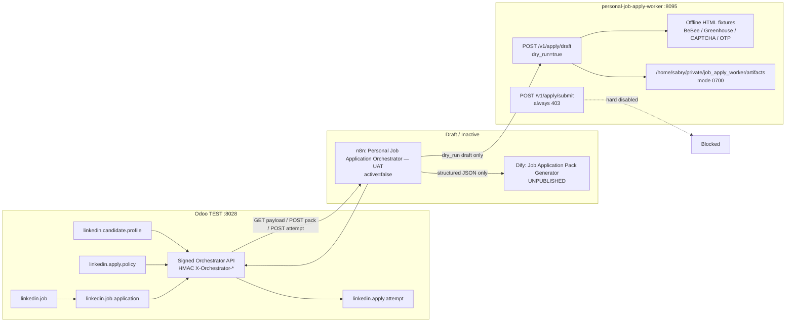

# Architecture — Personal Job Application Orchestrator (UAT P1–P3)

## Trust boundaries
- n8n never opens PostgreSQL; only signed HTTP to Odoo TEST.
- Dify has no Odoo / email / WhatsApp / browser write tools.
- Worker never receives real credentials or Production CV; LinkedIn URLs rejected.
- Company LinkedIn account id=1 cannot own applications/attempts.
