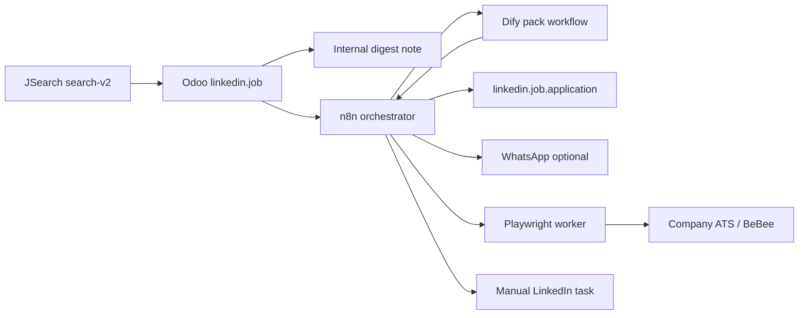

# Personal Job Application Orchestrator — Requirements & Capability Analysis

**Stamp:** `20260803T042931Z`  
**Scope:** Read-only inspection only (no code/DB/Dify/n8n/systemd/Docker/credential changes; no applications; no outbound messages; no CV upload).  
**Verdict:** `JOB_APPLICATION_ORCHESTRATOR_REQUIREMENTS_ANALYSIS_READY`

---

## 1. Executive summary (Arabic)

تم فحص البنية الحالية على السيرفر بدون أي تعديل. الاكتشاف اليومي عبر **JSearch** والملخص الداخلي في أودو **يعملان** للحساب الشخصي (id=2)، بينما **التقديم الآلي غير مفعّل وغير معتمد**. لا توجد وظائف LinkedIn مباشرة في القائمة الحالية؛ الروابط تأتي من مجمّع JSearch (Indeed / BeBee / غيرها)، وواجهة LinkedIn Jobs API غير متاحة بصلاحيات الحساب الحالية، وكشط LinkedIn ممنوع.

البنية المقترحة قابلة للتنفيذ على مراحل: أودو كمصدر حقيقة، Dify لتحليل الوظيفة وحزمة التقديم، n8n للتنسيق والموافقات، وعامل متصفح منفصل للتقديم على مواقع الشركات/ATS فقط — مع إيقاف فوري عند CAPTCHA أو OTP أو سؤال غير معروف. أفضل أول كاناري غير LinkedIn: وظيفة **Vivandi / BeBee (job id=10، score 65)** بوضع مسودة فقط بعد موافقة صريحة.

---

## 2. Fact vs recommendation legend

| Tag | Meaning |
| --- | --- |
| **VERIFIED** | Observed in this session via DB, Docker, HTTP, MCP, or filesystem |
| **RECOMMENDATION** | Proposed design / next step |
| **ASSUMPTION** | Inferred; needs Sabry confirmation |

---

## A. Current-state architecture (**VERIFIED**)

```
JSearch RapidAPI (search-v2)
    │  env: LINKEDIN_JSEARCH_RAPIDAPI_KEY via /etc/petspot/linkedin_jsearch.env
    ▼
Odoo 19 pet_spot_elsahel (:8027)  linkedin_connector 19.0.2.9.1
    ├─ ir.cron Daily JSearch (113) ACTIVE  → _cron_daily_jsearch()  personal id=2
    ├─ ir.cron Daily Digest  (112) ACTIVE  → _cron_daily_job_digest()  mail.mt_note → admin partner
    ├─ linkedin.job (12 rows, apps=0)
    ├─ linkedin.job.application (0)  review-first FSM exists but unused
    ├─ linkedin.cv.version id=1 / attachment 11383 (PDF)
    └─ Company account id=1 isolated (hash unchanged historically)
Publish / Feed / Messages crons INACTIVE
auto_create_applications=False
```

**Not connected today to job apply:** Dify apps, n8n workflows, Chatwoot/Evolution, Firefox container, Playwright package (installed in venv but no job-apply worker service).

---

## B. Capability inventory (**VERIFIED**)

### B.1 Cursor skills (personal + built-in)

| Name | Role | Installed | Access | Job-orchestrator use |
| --- | --- | --- | --- | --- |
| `platform-mcp-orchestrator` | Route Dify/n8n/Odoo/Chatwoot/OP | Yes | Read guidance | Orchestration design |
| `platform-ui-manager` | Browser admin of Dify/CW/OP/Evolution | Yes | UI via browser MCP if available | Configure Dify/n8n UIs |
| `platform-copilot` | WA/Dify/OP triage patterns | Yes | Patterns | Exception notification design |
| `whatsapp-message-analyzer` | WA triage JSON | Yes | Analysis | Approval alerts design |
| `openclaw-whatsapp` | OpenClaw WA channel ops | Yes | Ops | Not primary for job apply |
| `postman-newman-api-test` | API test suites | Yes | Test | Canary API contracts |
| `canvas` / `review-*` / `create-*` | IDE workflow | Yes | Local | Analysis artifacts |
| Client OP sync / Shopify / FB / GMB skills | Unrelated verticals | Yes | N/A | Out of scope |

### B.2 MCP servers (`~/.cursor/mcp.json`)

| MCP | Tools (summary) | Status | R/W | Contribution | Gaps |
| --- | --- | --- | --- | --- | --- |
| `user-n8n` | `list_workflows`, `get_workflow`, `trigger_webhook` | ready | List R/O; webhook can write if triggered | List/orchestrate flows | No credential introspection API |
| `user-dify-developer` | `Developer Assistant` | ready | AI Q&A | Dev help only — **no** job-pack app | Need dedicated Dify job app |
| `user-odoo` | schema/search/read + gated writes | ready | **Writes disabled** (`write_execution_enabled=false`) | Read models; writes via shell/UI | Not wired as apply writer |
| `user-chatwoot` | conversations/messages | ready | Read | Approval notifications | No job workflow yet |
| `user-evolution-whatsapp` | send/get/instances | ready | **Write-capable** (send) | WhatsApp alerts | Must stay gated |
| `user-openproject` | WPs | ready | Read | Track build tasks | Optional |
| `user-nextcloud` | files | ready | Read | Store evidence packs | Optional |
| `user-firefox-whatsapp` | Firefox WA container bridge | ready | Browser session | Pattern for persistent browser | **WhatsApp profile only**, not ATS |

**Not in mcp.json this host:** `cursor-ide-browser` (**VERIFIED** absent from mcp.json). Browser UI automation for ATS would need that MCP or a dedicated worker.

### B.3 CLI / host tools

| Capability | Present | Notes |
| --- | --- | --- |
| Odoo shell + PostgreSQL (`odoo` role) | Yes | Production + TEST DBs |
| `systemctl --user` pet_spot services | Yes | 8027 prod / 8028 test |
| Docker | Yes | Dify 1.15.0, n8n 1.98.2, Chatwoot, Evolution, Firefox, … |
| Playwright Python package | Yes (venv19) | **No** dedicated job-apply container/service found |
| Firefox binary `/usr/bin/firefox` | Yes | Host browser |
| `firefox-whatsapp` container | Yes | Persistent profile for WA Web; VNC HTTPS |
| Secrets files | Yes | e.g. `/etc/petspot/linkedin_jsearch.env` mode 640; `infra/n8n/.env` key names present (values not exposed) |
| Screenshots / evidence | Yes | Prior UAT under `linkedin_connector/docs/uat_evidence/` |
| Scheduling | Yes | Odoo `ir.cron` + n8n schedules |
| Monitoring | Yes | Uptime Kuma, Netdata, Dozzle, journalctl |
| Email | Partial | `ir_mail_server` count=1; digest uses **internal note** not SMTP send; `mail_gmail_connector` installed (job outreach keywords ICP present) |

### B.4 Stack services

| Service | Version/health | Job relevance |
| --- | --- | --- |
| Dify | `langgenius/dify-api:1.15.0` healthy | Analysis/pack generation (**RECOMMENDATION**) |
| n8n | `1.98.2` healthz ok | Orchestration; 20 workflows listed; **none** job-apply |
| Chatwoot | v4.1.0 up | Approval pings |
| Evolution | up (incl. petspot instance) | WhatsApp delivery |
| Ollama / Open WebUI | up | Local models for Dify (**ASSUMPTION** wired via providers) |
| JSearch | env file present | Discovery only |

---

## C. Reusable existing components (**VERIFIED**)

| Component | Reuse |
| --- | --- |
| `linkedin.job` + JSearch import/dedupe/score | Discovery SOFT |
| `_cron_daily_jsearch` / `_cron_daily_job_digest` | Keep as discovery+notify |
| `linkedin.job.application` FSM (`discovered→…→approved→applied`) | Core tracking |
| `action_prepare_pack` / cover letter / checklist / approval gate | Extend with Dify JSON |
| `linkedin.cv.version` + personal-only constraints | CV selection |
| Account isolation (`personal` vs `company`) | Hard requirement |
| Caps ICP (`jsearch_max_*`, `auto_create_applications`) | Pattern for apply caps |
| UAT evidence discipline | Canaries |
| n8n + Dify patterns (`chatwoot-ai-analysis`) | Copy human-in-loop style |
| `mail_gmail_connector` | Optional email-apply channel later (separate approval) |

---

## D. Missing capabilities (**VERIFIED** gaps / **RECOMMENDATION**)

| Missing | Impact |
| --- | --- |
| Dedicated Playwright/Chromium **job-apply worker** with isolated profiles | Cannot safely auto-submit ATS |
| Dify app/workflow for job analysis + pack JSON | No structured pack generation |
| n8n job-orchestrator workflow | No routing/retries/approvals for applies |
| Candidate profile model (salary, notice, sponsorship, truthful FAQs) | Pack answers incomplete |
| Platform router + apply receipt store | No submission audit |
| LinkedIn Jobs API access | LinkedIn listings only via aggregator URLs when present |
| cursor-ide-browser MCP on this host | Limited interactive browser from Cursor |
| Human Input / approval deep links | Digests are notes only today |
| Queue-mode n8n for heavy browser jobs | Single n8n container; runners enabled but not a browser queue (**ASSUMPTION**) |

---

## E. Functional requirements (**RECOMMENDATION**)

1. Discover jobs (existing JSearch).  
2. Qualify (score + hard exclusions + optional Dify match).  
3. Select CV version; never upload without approval.  
4. Generate cover letter + screening answers grounded in candidate profile KB.  
5. Route by platform class.  
6. Prepare pack → Sabry approval → optional browser submit **or** manual task.  
7. Stop on CAPTCHA/OTP/unknown question/consent.  
8. Store receipt (screenshot + confirmation text + final URL).  
9. Track status; notify via Odoo note and optional WhatsApp.  
10. Enforce daily/monthly apply caps; dedupe by job_id + canonical URL.

---

## F. Non-functional & security (**RECOMMENDATION**)

- Company id=1 never written by job hunt paths.  
- Secrets only in EnvironmentFile / n8n credentials vault — never ICP/Git/chat.  
- Browser profiles encrypted at rest; separate from WhatsApp Firefox.  
- Fail closed on caps, CAPTCHA, parse failure.  
- Retention: receipts N days; purge cookies on demand.  
- All auto-submit behind explicit approval flag per platform.  
- Audit: Odoo chatter + n8n execution log + evidence folder.  
- No LinkedIn guest scrape / CAPTCHA bypass / credential stuffing.

---

## G. Platform automation feasibility (**VERIFIED** sample + **RECOMMENDATION**)

Current Production jobs (n=12): Indeed 6, BeBee 3, other 3. **Zero** `linkedin.com` apply URLs in DB.

| Platform | Count now | Safe GET | Feasibility | Notes |
| --- | --- | --- | --- | --- |
| Indeed | 6 | Often **403** to bot UA | Low–Med | Needs authenticated browser profile; ToS risk |
| BeBee | 3 | **200** | Med | May require register; good draft canary |
| Jobrapido | 1 | 200 | Low | Aggregator; likely redirects later |
| Glassdoor | 1 | 403 | Low | Bot blocks |
| Himalayas | 1 | 403 | Low | Junior role; score 25 — exclude |
| Greenhouse/Lever/Workday | 0 | — | High (typical) | Best targets when URLs appear |
| Company career page | 0 confirmed | — | Med–High | Per-site adapters |
| Email `mailto:` | 0 | — | Med | Via Gmail connector later |
| LinkedIn | 0 URLs | — | **Manual task only** | No scrape/automation |

---

## H. Proposed Odoo data model changes (**RECOMMENDATION**)

| Model / field | Purpose |
| --- | --- |
| `linkedin.candidate.profile` | Truthful answers: salary, notice, visa, relocation, education, links |
| `linkedin.job.platform` / computed `apply_platform` | Classification enum |
| `linkedin.job.application` extensions | `pack_json`, `dify_run_id`, `n8n_execution_id`, `submit_channel`, `receipt_attachment_ids`, `exception_reason`, `manual_task` |
| `linkedin.apply.policy` / ICP | max applies/day, min score, allowed platforms, kill switch |
| `linkedin.apply.attempt` | Attempt log (start/stop/screenshot/error) |
| Keep `auto_create_applications` default False until approved |

---

## I. Proposed Dify design (**RECOMMENDATION**)

**App:** `Job Application Pack Generator` (workflow)  
**Inputs:** job title/company/location/description/URL/score; candidate profile JSON; CV text extract (local).  
**Outputs (strict JSON):** `match_decision`, `exclusion_flags`, `cover_letter`, `screening_qa[]`, `missing_facts[]`, `risk_notes`, `recommended_channel`.  
**KB:** Candidate facts (manual curated); sample successful packs; never store API keys.  
**Rules:** No invented employment history; escalate unknown questions; no direct Odoo writes.  
**Providers:** Prefer existing OpenAI/OpenWebUI/Ollama keys already named in `infra/n8n/.env` (presence only).

---

## J. Proposed n8n workflow design (**RECOMMENDATION**)

1. Trigger: Odoo webhook on `pack_ready` **or** cron after digest.  
2. Load job+profile from Odoo (read).  
3. Call Dify workflow API → pack JSON.  
4. Write pack fields to Odoo (approved write path).  
5. Notify Sabry (Odoo note + optional WA).  
6. Wait approval (webhook / chat button / Odoo state `approved`).  
7. Route:  
   - LinkedIn → create manual activity only.  
   - Allowed ATS → call browser worker.  
   - Unknown → exception queue.  
8. On success → `applied` + receipts; on stop → exception + notify.  
9. Error workflow + retries with backoff; never retry CAPTCHA.

**Existing n8n (sample):** `chatwoot-ai-analysis`, Dev Hub analysis, OP→WA alerts — patterns to copy; **no** job apply flow today.

---

## K. Proposed browser-worker API (**RECOMMENDATION**)

```
POST /v1/apply/draft   {job_url, profile_ref, cv_path, answers, dry_run:true}
POST /v1/apply/submit  {attempt_id, approval_token}   # only if dry_run previously OK
GET  /v1/apply/{id}    status, screenshots, final_url, stop_reason
```

**Must:** persistent profiles per platform; upload CV; screenshot; detect CAPTCHA/OTP/login wall; stop closed.  
**Must not:** LinkedIn automation; shared WhatsApp Firefox profile; store passwords in Odoo.

**Current:** Playwright importable in venv; Firefox WA container exists — **not** this API.

---

## L. Approval & exception workflow (**RECOMMENDATION**)

```
discovered → (optional auto) shortlisted → pack_ready → [Sabry approve] → approved
  → manual_open_url | browser_submit | blocked_exception
```

Exceptions: CAPTCHA, OTP, unknown question, ToS interstitial, paywall, 403 login, CV upload failure.  
Notify: Odoo activity on application + optional Evolution WhatsApp to Sabry only.

---

## M. Limits & anti-spam (**RECOMMENDATION**)

| Limit | Suggested start |
| --- | --- |
| JSearch API | Keep 3/day, 120/month (**VERIFIED** active) |
| New tracks/day | ≤ 5 |
| Approved submits/day | ≤ 2 |
| Per-company cooldown | 14 days |
| Min score to track | 50 (digest) / 65 (auto-track if approved) |
| Platforms enabled | BeBee draft → company ATS → Indeed last |

---

## N. Testing strategy (**RECOMMENDATION**)

1. Offline fixtures (saved HTML/JSON, no network).  
2. `pet_spot_elsahel_test` (:8028) module + fake jobs.  
3. Browser **draft-only** canary (fill form, no submit) on BeBee.  
4. One **approved** live canary submit after Sabry sign-off.  
5. Evidence pack under `uat_evidence/` with sanitized screenshots.

---

## O. Phased plan & acceptance (**RECOMMENDATION**)

| Phase | Deliverable | Acceptance |
| --- | --- | --- |
| P0 | This analysis | Verdict READY |
| P1 | Candidate profile + platform classify + auto-Track≥65 optional | Apps created only when flag on; company untouched |
| P2 | Dify pack workflow + n8n write-back | Pack JSON on application; digest still internal |
| P3 | Browser worker draft-only | Screenshots; stop on CAPTCHA; no submit |
| P4 | One live canary submit | Receipt + state=applied; caps enforced |
| P5 | Expand ATS adapters | Greenhouse/Lever when URLs appear |

---

## P. Risks, blockers, assumptions, decisions

**Risks:** Site ToS; bot 403; account bans; hallucinated answers; CV leakage; company account contamination.  
**Blockers:** No LinkedIn Jobs API; no dedicated apply browser worker; auto-apply **not approved**.  
**Assumptions:** Sabry will maintain truthful profile; WhatsApp alerts acceptable; BeBee account may be created manually once.  

**Decisions required (Sabry):** see §5 below.

---

## Q. First non-LinkedIn canary recommendation (**RECOMMENDATION**)

| Field | Value |
| --- | --- |
| Job | **id=10** — Odoo Techno Functional Consultant @ Vivandi |
| Score | 65 |
| URL host | `bebee.com` (**VERIFIED** HTTP 200, 0 hops) |
| Why | Highest-quality non-Indeed link; readable without bot 403; matches Odoo senior profile; not LinkedIn |
| Mode | **Draft-only browser** after P3; **no submit** until separate live approval |
| Avoid first | Indeed (403 to automation UA), Himalayas junior (score 25), Glassdoor 403 |

Alternative: job **id=8** Melya Cleaning (BeBee, score 65) if Vivandi listing expires.

---

## 3. Capability matrix (compact)

See Canvas `job-application-orchestrator-analysis.canvas.tsx` and table B above.

---

## 4. Architecture diagram (target)



---

## 5. Questions requiring Sabry’s decision

1. Auto-**Track** applications for score ≥ 65, or keep fully manual Track?  
2. Target monthly **submit** budget (suggested 10–20)?  
3. Salary range, notice period, UAE relocation, visa sponsorship answers (truthful)?  
4. Allow WhatsApp approval alerts, or Odoo-only?  
5. Willing to create **BeBee** (and later Indeed) accounts for applying?  
6. First live canary: Vivandi/BeBee ok?  
7. Is `mail_gmail_connector` in-scope for mailto/employer email applies later?  
8. Approve building a **dedicated** Playwright worker (separate from WhatsApp Firefox)?

---

## 6. Evidence paths

| Item | Path / locator |
| --- | --- |
| This report | `linkedin_connector/docs/uat_evidence/job_orchestrator_requirements_20260803T042931Z/REPORT.md` |
| Apply URL SQL classification | Session queries on `pet_spot_elsahel.linkedin_job` |
| Redirect probe JSON | Embedded in analysis notes under same stamp dir (`redirect_probe.json`) |
| Prior JSearch canary | `.../prod_jsearch_canary_20260803T033147Z/` |
| Daily digest activation | `.../prod_daily_digest_activation_20260803T034448Z/` |
| JSearch secret file | `/etc/petspot/linkedin_jsearch.env` (present, mode 640) |
| Dify containers | `docker-api-1` image `langgenius/dify-api:1.15.0` healthy |
| n8n | container `n8n` `1.98.2`; MCP `list_workflows` count 20 |
| Firefox WA | `/home/sabry/docker/firefox-whatsapp/` |
| MCP config | `~/.cursor/mcp.json` |
| Skills | `~/.cursor/skills/`, `~/.cursor/skills-cursor/` |
| Canvas | `~/.cursor/projects/.../canvases/job-application-orchestrator-analysis.canvas.tsx` |

---

## Final verdict

**`JOB_APPLICATION_ORCHESTRATOR_REQUIREMENTS_ANALYSIS_READY`**
