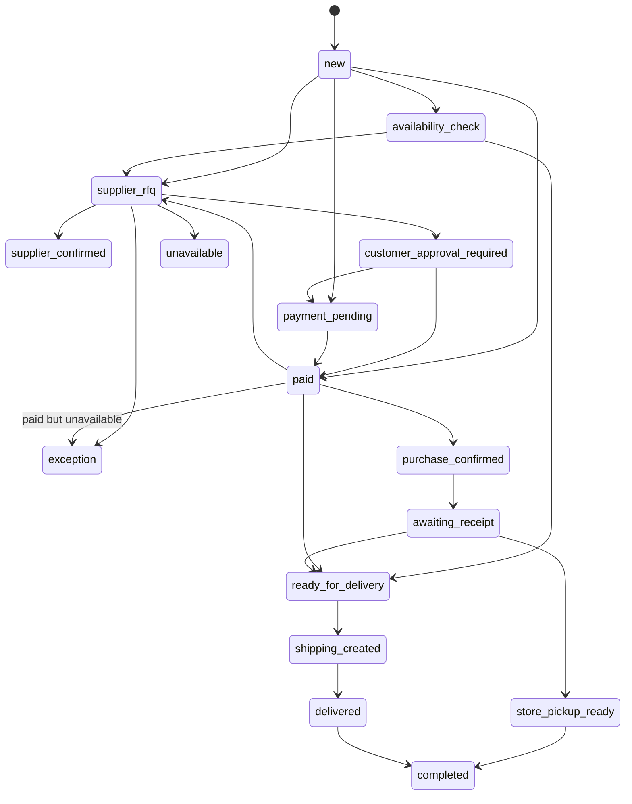

# PetSpot Fulfillment — Final Report

**Verdict: `TEST_READY_AWAITING_PRODUCTION_APPROVAL`**

Date: 2026-07-30  
Evidence: `/home/sabry/.cursor/evidence/petspot-fulfillment-20260730-125718/`

## Architecture and state diagram

Orchestration state coordinates native SO/PO/payment/picking; it does **not** replace them.

### Path A (supplier B2B)
Shopify order → one Odoo SO (connector idempotency) → fulfillment case → classify `supplier_b2b` → draft RFQ once → supplier confirm → customer approval if price/ETA changed → payment gate → confirm SO/PO (manager) → receipt → ready → ShipBlu via existing Duplicate AWB Guard → tracking sync (existing).

### Path B (WhatsApp / manual)
Storefront CTA unchanged (WhatsApp only) → staff records Availability Inquiry → optional store/supplier check → one quotation/case → payment → ShipBlu **or** store pickup (no AWB).

## Modules

| Role | Module | Version |
|------|--------|---------|
| **New** orchestration | `petspot_fulfillment` | **19.0.1.0.0** |
| Reused | `custom_odoo_shopify_connector` | 19.0.1.9.0 |
| Reused | `delivery_shipblu` (+ Duplicate AWB Guard) | 19.0.1.4.0 |
| Reused | `sale_management`, `purchase`, `stock`, `mail` | std |

No Odoo core / vendor module edits.

## Repository / branch / commit

- Path: `/home/sabry/odoo_base/base_odoo_19/projects/pet_spot_elsahel`
- Branch: `feature/petspot-fulfillment-orchestration`
- Module path: `petspot_fulfillment/` (committed separately from unrelated dirty tree)

## Idempotency keys / constraints

| Entity | Key |
|--------|-----|
| Case | `idempotency_key` UNIQUE (`shopify:<store>:<order_id>` or `odoo-so:<id>`) |
| Case | UNIQUE `(shopify_store_id, shopify_order_id)` |
| Line | UNIQUE `(case_id, sale_line_id)` |
| Inquiry | `idempotency_key` UNIQUE (`inquiry:msg:…`) |
| RFQ | origin marker `petspot-ff:<case_id>:vendor:<vendor_id>` + case M2M; row lock `FOR UPDATE` |
| SO import | connector `shopify_order_id` UNIQUE (unchanged) |
| ShipBlu | existing Duplicate AWB Guard (unchanged) |

## Payment rules

- Trusted signals: `shopify_amount_paid` / `shopify_order_total` (connector); Odoo invoice paid; manager **Mark Paid** with reference + audit.
- Already-paid Shopify → case `payment_status=paid` (never pretend postponed).
- Paid + unavailable → `exception` / `refund_review` — **no auto refund**.
- Unpaid → cannot ShipBlu / cannot confirm PO.
- Never infer payment from WhatsApp.

## Purchase approval rules

- Draft RFQ only; never auto-confirm PO.
- Missing vendor → activity + UserError.
- Price/ETA change → `customer_approval_required`.
- Confirm SO/PO requires manager group + payment + approval.

## ShipBlu gates

Allowed only when: not cancelled/unavailable; payment OK; supplier confirmed if B2B; customer approval done; state `ready_for_delivery`; delivery ≠ store_pickup; no existing AWB; delegates to existing picking ShipBlu methods (Duplicate Guard).

Shopify ShipBlu auto-create: **must remain OFF** (Odoo sole creator). Workflow automation ICP: **False**.

## Shopify sync behavior

- Case auto-bind on SO create when `shopify_order_id` present and cutover-eligible.
- Historical orders: set `petspot_fulfillment.cutover_timestamp` — create hook skips; reconciliation-only via explicit open.
- Does not alter products, variants, collections, inventory, theme, or `petspot.availability_mode`.

## Automated tests

`0 failed, 0 error(s) of 20 tests` — log: `evidence/.../tests_petspot_fulfillment_4.log`

Covers: import once, replay, RFQ once, missing vendor, paid unavailable → exception, price approval, unpaid ship block, paid retention, inquiry alone, quote once, store stock no PO, pickup no AWB, mixed lines, transition audit, purchase needs payment, cutover skip, ship before ready, receipt→ready, ACL Mark Paid, product write_date untouched.

## TEST UAT evidence

File: `evidence/.../uat/uat_results.json`

| | Result |
|--|--------|
| UAT A | SO S00591 / case FF/2026/00063 / RFQ P00012 draft / approval gate / paid / ShipBlu blocked until ready |
| UAT B | INQ/2026/00011 → S00592 once / pickup blocks AWB / completed handover |
| Automation | `False` |

## Catalog / theme confirmation

Diff contains **only** `petspot_fulfillment/`. No Shopify Admin product/metafield/theme API calls in this task. Storefront CTA / `availability_mode` unchanged by design.

## Production backup / deployment / cutover / canary

| Item | Status |
|------|--------|
| Production deploy | **Not done** (awaiting approval) |
| Backup / checksum | Deferred to Phase 13 |
| Cutover timestamp | Empty on TEST; set on PROD at go-live |
| First real-order canary | **Not started** |

## Rollback procedure

1. Set `petspot_fulfillment.automation_enabled=False` (already default).
2. Optionally uninstall or deactivate menus/groups.
3. Existing SO/PO/ShipBlu records remain; orchestration cases can stay for audit.
4. Revert git commit / redeploy previous module set.
5. Do **not** bulk-replay Shopify history.

## Remaining limitations

- Shopify Draft Order API not implemented in connector (inquiry can link draft id manually when available).
- No fragile WhatsApp free-text auto-parse; Chatwoot link is optional fields + manual form.
- ShipBlu create still requires outgoing picking + existing ShipBlu methods; first PROD AWB stays manual.
- Concurrent stress beyond row locks not load-tested.
- Unrelated dirty files on branch intentionally **not** committed.

## Allowed next step

After explicit Production approval: backup → deploy exact commit → upgrade `petspot_fulfillment` only → smoke with automation OFF → set cutover → enable for **new** orders only → first real canary with manual PO + ShipBlu.
