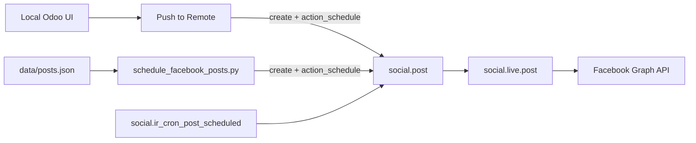

# Facebook Scheduled Posts — Setup Guide

Compose posts in **local Odoo** (`http://127.0.0.1:8027`) and push them to Odoo Online as `social.post` → Facebook via Social Marketing.

The **Odoo UI** (Social Media Connector app) is the primary workflow. CLI scripts remain available for batch/CI.

## Prerequisites

- **Local Odoo**: `pet_spot_elsahel` with **Social Media Connector** installed
- **Odoo Online**: Social Marketing + Facebook connected (`social`, `social_facebook` on e.g. `deebvet.odoo.com`)
- API key for your Odoo Online user (Settings → Users → API Keys)

## Primary workflow — Local Odoo UI

### 1. Install the module

Apps → search **Social Media Connector** → Install.

Or from shell (service must be stopped):

```bash
sudo systemctl stop pet_spot_elsahel
/home/sabry3/sabry_backup/odoo_base/base_odoo_19/venv19/bin/python3 \
  /home/sabry3/sabry_backup/odoo_base/base_odoo_19/odoo19/odoo19/odoo-bin \
  -c /home/sabry3/sabry_backup/odoo_base/base_odoo_19/config/projects/pet_spot_elsahel.conf \
  -d pet_spot_elsahel -i social_media_connector --stop-after-init
sudo systemctl start pet_spot_elsahel
```

### 2. Configure remote Odoo Online

**Social Media Connector → Configuration → Settings**

| Setting | Example | Notes |
|---------|---------|-------|
| Remote Odoo URL | `https://deebvet.odoo.com` | Base URL only — **no** `/odoo` suffix |
| Remote Database | `deebvet` | |
| Remote Username | your@email.com | |
| Remote API Key | `...` | Preferred over password |
| Campaign Prefix | `[PetSpot FB]` | Prepended to pushed messages (idempotency) |

Click **Save**, then **Test Connection**, then **Fetch Facebook Pages**.

### 3. Create and push a post

**Social Media Connector → Posts → Create**

1. Set **Internal Title**, **Facebook Page**, **Message**, attach **Images**
2. Choose **Schedule** + **Scheduled Date** (or **Post Now**)
3. **Mark Ready** → **Push to Remote**

List view: select ready posts → **Action → Push Selected**.

Auto-push (optional): enable **Auto-push Ready Posts** in Settings; cron runs every 5 minutes and pushes ready scheduled posts within the lead window (default 15 minutes before `scheduled_date`).

### 3b. Fetch all posts (feeds + Online + campaign JSON)

**Fetch All Posts** imports three sources:

| Source | Odoo Online model | What it is |
|--------|-------------------|------------|
| **Feeds** | `social.stream.post` | Existing Facebook posts in Social Marketing → Feed (~150+) |
| **Scheduled** | `social.post` | Posts created via connector / Social Marketing scheduler |
| **Campaign** | `data/posts.json` | Local Sahel draft posts not yet on Online |

- **Configuration → Settings → Fetch All Posts**, or
- **Posts** → **Action → Fetch All Posts**

Feed photos are downloaded via Facebook Graph API (page token). Pages marked **disconnected** on Online import as text-only until you reconnect Facebook there and re-run fetch.

### 3c. Prepare campaign reposts (contact footer + draft)

After fetching, prepare **unique posts with images** for the repost campaign:

- **Settings → Prepare Campaign Reposts**, or
- **Posts** → **Action → Prepare Campaign Reposts**

This will (~23 posts):

1. Deduplicate by message (keep one per unique text, with image)
2. Append bilingual contact footer (`[PetSpot Contact]` marker):
   - WhatsApp `01000059085`, Call `01201568888`
   - Website `https://petspot.odoo.com`, location + maps link
   - Facebook `https://www.facebook.com/1378190768902001`, LinkedIn `https://www.linkedin.com/company/129944345`
3. Reset to **draft**, assign main page, stagger `scheduled_date`
4. Clear remote IDs for fresh push to Online

Filter: **Campaign Drafts** in Posts list.

```bash
python3 scripts/prepare_campaign_posts.py
```

Then **Mark Ready** → **Push to Remote** (or enable auto-push).

```bash
python3 scripts/fetch_all_posts.py
```

### 4. Verify on Odoo Online

1. Open **Social Marketing → Posts** on `deebvet.odoo.com`
2. Find posts starting with `[PetSpot FB`
3. Confirm `state = Scheduled` → later `Posted` on Facebook

### Integration test script

```bash
cd projects/pet_spot_elsahel/social_media_connector
python3 scripts/test_ui_push.py
```

Syncs pages, creates a test post for **Pet spot amwaj**, pushes to remote, prints `remote_post_id`.

---

## Secondary workflow — CLI scripts

For batch scheduling from `data/posts.json` without the UI.

### Configure `.env`

```bash
cp .env.example .env
# Edit credentials
```

| Variable | Example | Notes |
|----------|---------|-------|
| `ODOO_URL` | `https://deebvet.odoo.com` | Base URL only — **no** `/odoo` suffix |
| `ODOO_DB` | `deebvet` | |
| `ODOO_USERNAME` | your@email.com | |
| `ODOO_API_KEY` | `...` | |
| `CAMPAIGN_PREFIX` | `[PetSpot FB]` | |
| `FACEBOOK_PAGE_N_ODOO_ACCOUNT_ID` | `3` | From `discover_pages.py` |

### Quick start (CLI)

```bash
cd projects/pet_spot_elsahel/social_media_connector

python3 scripts/test_connection.py
python3 scripts/discover_pages.py
python3 scripts/schedule_facebook_posts.py --test
python3 scripts/schedule_facebook_posts.py
python3 scripts/schedule_facebook_posts.py --limit 3
python3 scripts/schedule_facebook_posts.py --dry-run
```

## Post JSON format (`data/posts.json`)

```json
{
  "campaign": "PetSpot El Sahel — Facebook Summer 2026",
  "defaults": {
    "interval_minutes": 60,
    "timezone": "Africa/Cairo",
    "image": "assets/images/petspot-opening-hero.png",
    "page_key": "FACEBOOK_PAGE_1"
  },
  "posts": [
    {
      "topic": "Grand opening",
      "page_key": "FACEBOOK_PAGE_1",
      "message": "Post text…",
      "scheduled_at": "2026-06-20 10:00:00"
    }
  ]
}
```

CLI posts are prefixed with `[PetSpot FB 01] — topic`. UI posts use `[PetSpot FB] {title}`.

## How publishing works



1. Local UI or script creates `social.post` on Odoo Online with `post_method=scheduled`
2. `action_schedule()` → `state=scheduled`
3. Odoo Online cron publishes at `scheduled_date`
4. Facebook post uses tokens on `social.account`

## Troubleshooting

| Issue | Fix |
|-------|-----|
| `database "petspot" does not exist` | Set `deebvet` as remote DB |
| Auth failed | Check API key; user needs Social Marketing access on Online |
| Test Connection: modules missing | Install `social` + `social_facebook` on Online |
| No Facebook pages locally | Settings → **Fetch Facebook Pages** |
| Push validation error | Message + image + page + schedule required; use **Mark Ready** |
| `bytes is not JSON serializable` | Fixed in module — upgrade `social_media_connector` |
| Duplicate posts on CLI re-run | Script removes draft/scheduled with same `CAMPAIGN_PREFIX` |
| UI post already pushed | Use **Re-push** to replace remote draft/scheduled |
| Facebook post **Failed** — `pages_read_engagement` / impersonating page | **Reconnect Facebook on Odoo Online** (see below) — not an image size issue |
| `is_media_disconnected` on page | Remote token expired/revoked; reconnect Facebook |

### Facebook permission error (post Failed on Odoo Online)

If the post reaches Odoo Online but fails on Facebook with:

> *Any of the pages_read_engagement, pages_manage_metadata, pages_read_user_content… must be granted before impersonating a user's page*

This is **not** caused by the local push module or image size. The **Facebook page token** stored on Odoo Online is invalid or missing required scopes.

**Diagnose:**

```bash
cd projects/pet_spot_elsahel/social_media_connector
python3 scripts/check_facebook_permissions.py
```

**Fix on `deebvet.odoo.com`:**

1. Log in as a user with **Social Marketing Manager** rights
2. Open **Social Marketing** (or use **Open Remote Social Marketing** in local Settings)
3. Go to **Configuration → Social Accounts** (or the accounts panel)
4. For **Pet spot amwaj** (shows disconnected / broken link):
   - Remove the old account **or** click **Reconnect**
   - Click **Add Account → Facebook**
5. In the Facebook popup:
   - Log in with a Facebook user who is **Admin** of the Pet spot amwaj page
   - Accept **all** permission requests (do not skip)
   - Select **Pet spot amwaj** when asked which pages to link
6. Back in Odoo Online: **Fetch Facebook Pages** on local Odoo (to refresh `is_disconnected`)
7. On the failed post: open **Posts By Account** → click **Retry**

Until step 4–5 is done, new pushes from local Odoo will keep failing at the Facebook step.

## Module layout

```
social_media_connector/
├── __manifest__.py
├── models/
│   ├── social_media_remote.py   # JSON-RPC client
│   ├── social_media_page.py     # cached remote pages
│   ├── social_media_post.py     # compose + push
│   └── res_config_settings.py
├── views/
├── security/
├── data/ir_cron_data.xml
├── .env / .env.example
├── data/posts.json
├── scripts/                     # CLI (secondary)
└── FACEBOOK_SETUP.md
```

## Connected pages (deebvet.odoo.com)

Run **Fetch Facebook Pages** in Settings or `discover_pages.py`. **Default / main page** (most followers):

- **بيت الدواء البيطري -pet spot** → `FACEBOOK_PAGE_1` → remote `social.account` id **4** (connected)

Branch page (North Coast):

- **Pet spot amwaj** → `FACEBOOK_PAGE_2` → remote account id `3` (reconnect if disconnected)
